R Notebook
================

``` r
library(ggplot2)
library(RColorBrewer)
library(dplyr)
library(GGally)
library(readr)
library(ggjoy)
library(FactoMineR)
library(factoextra)
library(ggpubr)
library(corrplot)
library(cowplot)
library(glue)
library(car)
library(tidyverse)
library(gplots)
```

``` r
Medicalpremium <- read_csv("C:/Users/malis/3rdYear/New folder (3)/New folder/Medicalpremium.csv")
df = Medicalpremium
df
```

    ## # A tibble: 986 × 11
    ##      Age Diabetes BloodPressureProblems AnyTransplants AnyChronicDiseases Height
    ##    <dbl>    <dbl>                 <dbl>          <dbl>              <dbl>  <dbl>
    ##  1    45        0                     0              0                  0    155
    ##  2    60        1                     0              0                  0    180
    ##  3    36        1                     1              0                  0    158
    ##  4    52        1                     1              0                  1    183
    ##  5    38        0                     0              0                  1    166
    ##  6    30        0                     0              0                  0    160
    ##  7    33        0                     0              0                  0    150
    ##  8    23        0                     0              0                  0    181
    ##  9    48        1                     0              0                  0    169
    ## 10    38        0                     0              0                  0    182
    ## # ℹ 976 more rows
    ## # ℹ 5 more variables: Weight <dbl>, KnownAllergies <dbl>,
    ## #   HistoryOfCancerInFamily <dbl>, NumberOfMajorSurgeries <dbl>,
    ## #   PremiumPrice <dbl>

## preprocessing

``` r
cat.cols = colnames(df[, -c(which(colnames(df) %in% c("Age", "Weight", "Height", "PremiumPrice")))])
num.cols = colnames(df[, c(which(colnames(df) %in% c("Age", "Weight", "Height", "PremiumPrice")))])
cat.cols
```

    ## [1] "Diabetes"                "BloodPressureProblems"  
    ## [3] "AnyTransplants"          "AnyChronicDiseases"     
    ## [5] "KnownAllergies"          "HistoryOfCancerInFamily"
    ## [7] "NumberOfMajorSurgeries"

``` r
num.cols
```

    ## [1] "Age"          "Height"       "Weight"       "PremiumPrice"

``` r
df[, cat.cols] = lapply(df[, cat.cols], factor)
lapply(df, class)
```

    ## $Age
    ## [1] "numeric"
    ## 
    ## $Diabetes
    ## [1] "factor"
    ## 
    ## $BloodPressureProblems
    ## [1] "factor"
    ## 
    ## $AnyTransplants
    ## [1] "factor"
    ## 
    ## $AnyChronicDiseases
    ## [1] "factor"
    ## 
    ## $Height
    ## [1] "numeric"
    ## 
    ## $Weight
    ## [1] "numeric"
    ## 
    ## $KnownAllergies
    ## [1] "factor"
    ## 
    ## $HistoryOfCancerInFamily
    ## [1] "factor"
    ## 
    ## $NumberOfMajorSurgeries
    ## [1] "factor"
    ## 
    ## $PremiumPrice
    ## [1] "numeric"

``` r
dt = df
```

## feature engineering

``` r
dt = dt %>%
  mutate(BMI = df$Weight/((df$Height/100)^2)) %>%
  mutate(BMI_cat = cut(BMI, breaks=c(-Inf, 18.5, 24.5, 29.9, 34.9, Inf), 
                       labels=c("underweight", "normal", "overweight", "obese", "Extreme")))
dt
```

    ## # A tibble: 986 × 13
    ##      Age Diabetes BloodPressureProblems AnyTransplants AnyChronicDiseases Height
    ##    <dbl> <fct>    <fct>                 <fct>          <fct>               <dbl>
    ##  1    45 0        0                     0              0                     155
    ##  2    60 1        0                     0              0                     180
    ##  3    36 1        1                     0              0                     158
    ##  4    52 1        1                     0              1                     183
    ##  5    38 0        0                     0              1                     166
    ##  6    30 0        0                     0              0                     160
    ##  7    33 0        0                     0              0                     150
    ##  8    23 0        0                     0              0                     181
    ##  9    48 1        0                     0              0                     169
    ## 10    38 0        0                     0              0                     182
    ## # ℹ 976 more rows
    ## # ℹ 7 more variables: Weight <dbl>, KnownAllergies <fct>,
    ## #   HistoryOfCancerInFamily <fct>, NumberOfMajorSurgeries <fct>,
    ## #   PremiumPrice <dbl>, BMI <dbl>, BMI_cat <fct>

``` r
dq = dt %>%
  mutate(Age_cat = cut(Age, breaks=c(17, 30, 59, Inf), labels=c("Young Adult", "Adult", "Old")))
dq
```

    ## # A tibble: 986 × 14
    ##      Age Diabetes BloodPressureProblems AnyTransplants AnyChronicDiseases Height
    ##    <dbl> <fct>    <fct>                 <fct>          <fct>               <dbl>
    ##  1    45 0        0                     0              0                     155
    ##  2    60 1        0                     0              0                     180
    ##  3    36 1        1                     0              0                     158
    ##  4    52 1        1                     0              1                     183
    ##  5    38 0        0                     0              1                     166
    ##  6    30 0        0                     0              0                     160
    ##  7    33 0        0                     0              0                     150
    ##  8    23 0        0                     0              0                     181
    ##  9    48 1        0                     0              0                     169
    ## 10    38 0        0                     0              0                     182
    ## # ℹ 976 more rows
    ## # ℹ 8 more variables: Weight <dbl>, KnownAllergies <fct>,
    ## #   HistoryOfCancerInFamily <fct>, NumberOfMajorSurgeries <fct>,
    ## #   PremiumPrice <dbl>, BMI <dbl>, BMI_cat <fct>, Age_cat <fct>

``` r
cat.cols = colnames(dt)[lapply(dt, class) == "factor"]
num.cols = colnames(dt)[lapply(dt, class) == "numeric"]
```

## EDA

``` r
attach(dt)
```

``` r
ggplot(dt, mapping=aes(x=Age,
                       y=NumberOfMajorSurgeries, 
                       fill=NumberOfMajorSurgeries)) +
  geom_boxplot() +
  scale_fill_manual(values=c("darkred", "firebrick", "indianred2", "lightsalmon"))
```

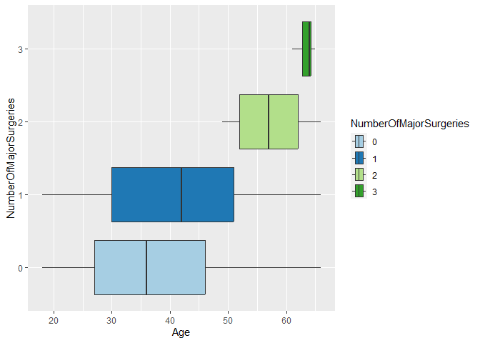<!-- -->

``` r
dt %>%
  group_by(NumberOfMajorSurgeries) %>%
  count()
```

    ## # A tibble: 4 × 2
    ## # Groups:   NumberOfMajorSurgeries [4]
    ##   NumberOfMajorSurgeries     n
    ##   <fct>                  <int>
    ## 1 0                        479
    ## 2 1                        372
    ## 3 2                        119
    ## 4 3                         16

``` r
ggplot() +
  geom_joy(dt, mapping=aes(x=Age, 
                        y=NumberOfMajorSurgeries,
                        fill=BloodPressureProblems), scale=1, alpha=0.7, rel_min_height=0.02) +
  scale_fill_brewer(palette = "Set1")
```

    ## Picking joint bandwidth of 2.63

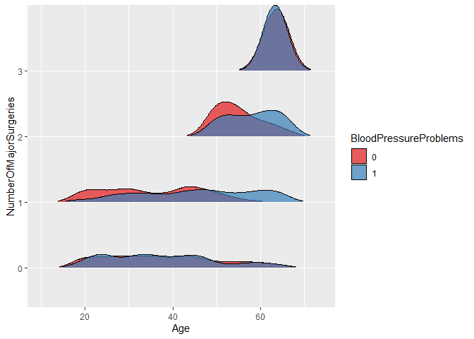<!-- -->

``` r
cols = c("darkred", "firebrick", "indianred2", "salmon", "lightsalmon")
cat.cols = colnames(dq)[lapply(dt, class) == "factor"]
for (i in cat.cols) {
  plt = ggplot(dq, aes(y=!!sym(i), x=PremiumPrice, fill=!!sym(i))) +
    geom_boxplot() +
    scale_fill_manual(values=cols)
  print(plt)
}
```

``` r
ggplot(dq, aes(y=AnyTransplants, x=PremiumPrice, fill=AnyTransplants)) +
    geom_boxplot() +
    scale_fill_manual(values=c("darkred", "indianred2")) +
  theme(legend.position = "bottom")
```

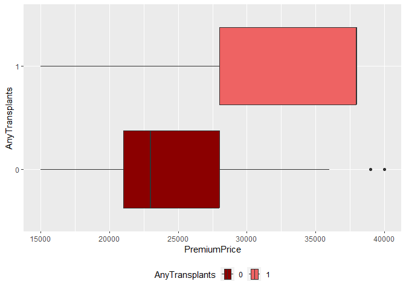<!-- -->

``` r
ggplot(dq, aes(y=AnyChronicDiseases, x=PremiumPrice, fill=AnyChronicDiseases)) +
    geom_boxplot() +
    scale_fill_manual(values=c("darkred", "indianred2")) +
  theme(legend.position = "bottom")
```

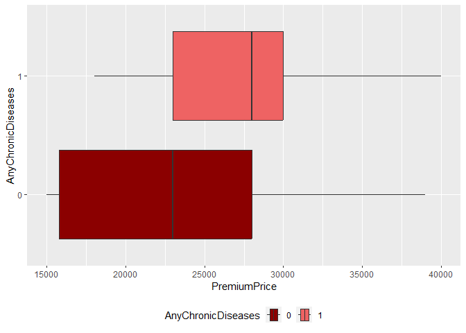<!-- -->

``` r
ggplot(dq, aes(y=HistoryOfCancerInFamily, x=PremiumPrice, fill=HistoryOfCancerInFamily)) +
    geom_boxplot() +
    scale_fill_manual(values=c("darkred", "indianred2")) +
  theme(legend.position = "bottom")
```

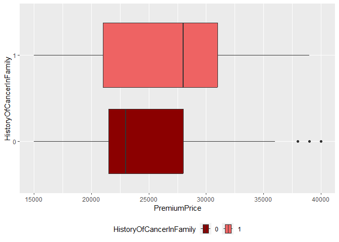<!-- -->

``` r
ggplot(dq, aes(y=BloodPressureProblems, x=PremiumPrice, fill=BloodPressureProblems)) +
    geom_boxplot() +
    scale_fill_manual(values=c("darkred", "indianred2"))
```

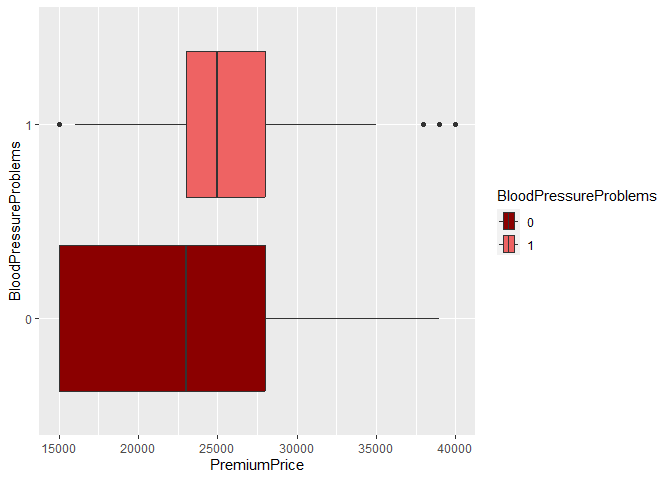<!-- -->

``` r
ggplot(dq, aes(y=Diabetes, x=PremiumPrice, fill=Diabetes)) +
    geom_boxplot() +
    scale_fill_manual(values=c("darkred", "indianred2")) +
  theme(legend.position = "bottom")
```

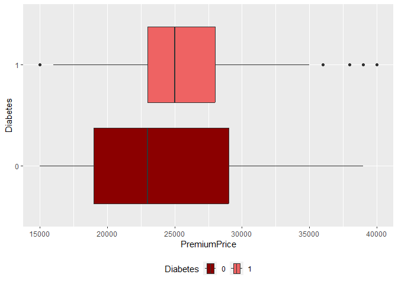<!-- -->

``` r
ggplot(dq, aes(y=NumberOfMajorSurgeries, x=PremiumPrice, fill=NumberOfMajorSurgeries)) +
    geom_boxplot() +
    scale_fill_manual(values=cols) +
  theme(legend.position = "bottom")
```

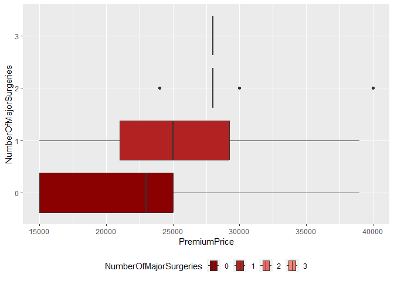<!-- -->

``` r
plt1 = ggplot(dq, aes(y=NumberOfMajorSurgeries, x=PremiumPrice, fill=NumberOfMajorSurgeries)) +
    geom_boxplot() +
    scale_fill_manual(values=cols) +
  labs(y="") +
  theme(legend.position = "none")

temp = dq %>% 
  group_by(NumberOfMajorSurgeries) %>%
  summarise(mean_price=mean(PremiumPrice)) %>%
  arrange(desc(mean_price))
  
plt2 = ggplot(temp, aes(y=NumberOfMajorSurgeries, x=mean_price, fill=NumberOfMajorSurgeries)) +
    geom_bar(stat="identity") +
    scale_fill_manual(values = cols) +
    labs(x="mean Premium Price") +
  theme(legend.position = "none")


leg = get_legend(plt2 +
                   theme(legend.position = "bottom"))

cow1 = plot_grid(plt2, plt1, ncol=2, rel_heights=c(2, 1))

plot_grid(cow1 , leg, ncol=1, rel_heights = c(1, 0.1))
```

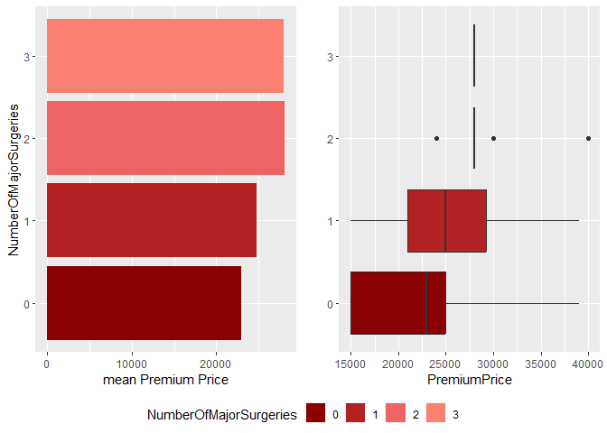<!-- -->

``` r
cat.cols = colnames(dq)[lapply(dq, class) == "factor"]
for (i in cat.cols) {
  temp = dq %>% 
  group_by(!!sym(i)) %>%
  summarise(mean_price=mean(PremiumPrice)) %>%
  arrange(desc(mean_price))
  
  plt = ggplot(temp, aes(x=!!sym(i), y=mean_price, fill=!!sym(i))) +
    geom_bar(stat="identity") +
    scale_fill_manual(values = cols) +
    labs(y="mean Premium Price")
  print(plt)
}
```

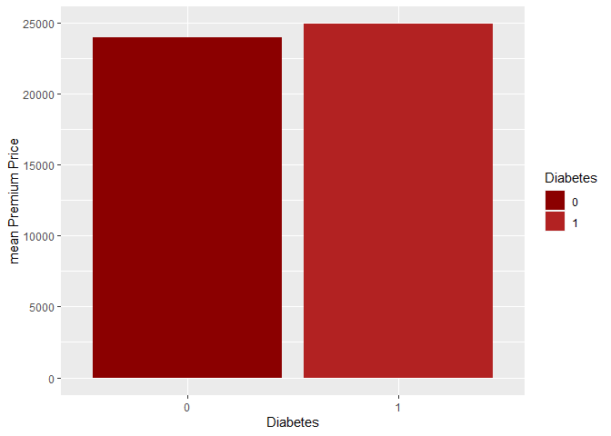<!-- -->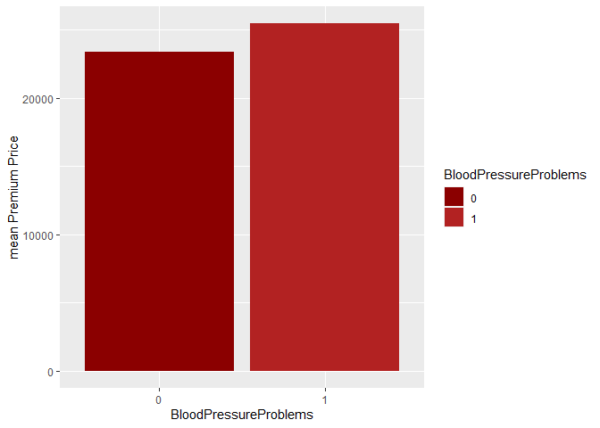<!-- -->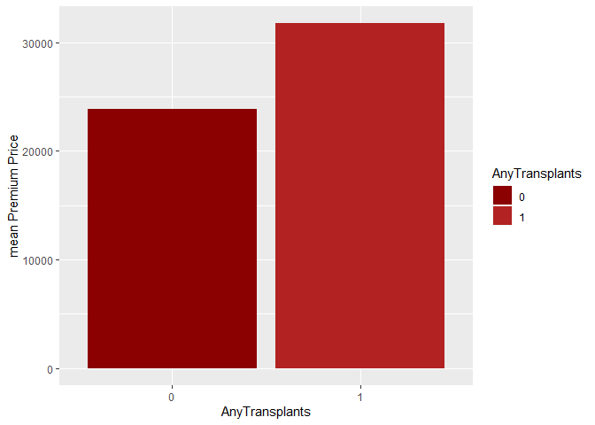<!-- -->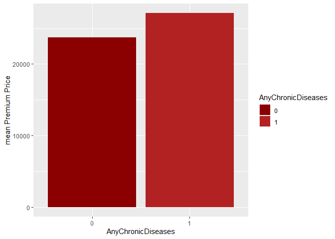<!-- -->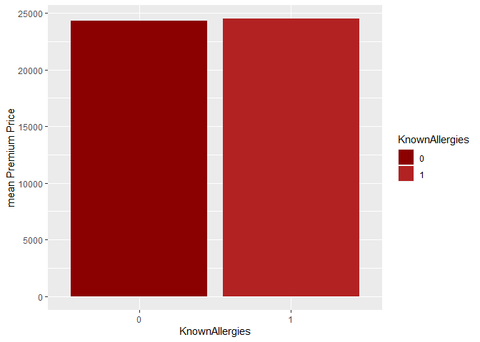<!-- -->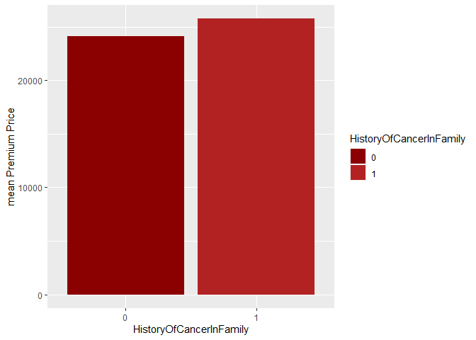<!-- -->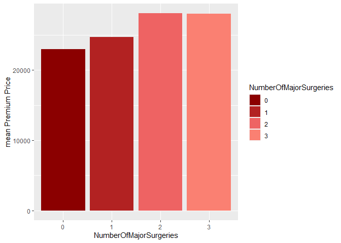<!-- -->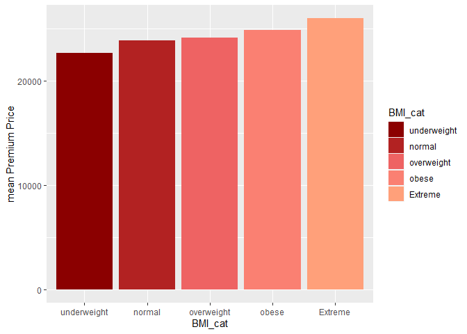<!-- -->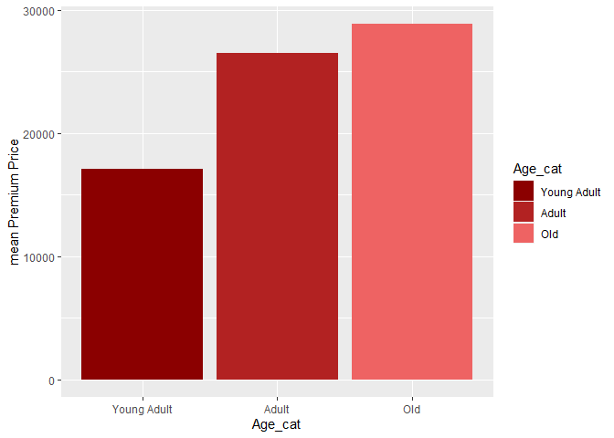<!-- -->

``` r
temp = dq %>% 
  group_by(Age_cat) %>%
  summarise(mean_price=mean(PremiumPrice)) %>%
  arrange(desc(mean_price))
  
  plt = ggplot(temp, aes(x=Age_cat, y=mean_price, fill=Age_cat)) +
    geom_bar(stat="identity") +
    scale_fill_manual(values = c("darkred", "indianred2", "lightsalmon")) +
    labs(y="mean Premium Price") +
    theme(legend.position = "bottom")
  print(plt)
```

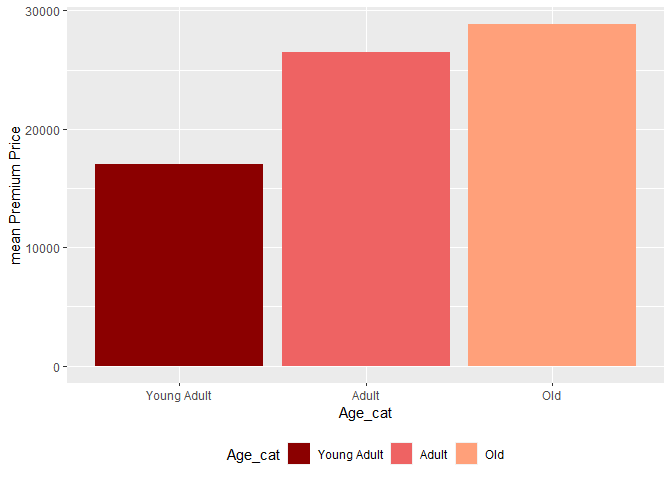<!-- -->

``` r
temp = dq %>% 
  group_by(Age) %>%
  summarise(mean_price=mean(PremiumPrice)) %>%
  arrange(desc(Age))
temp
```

    ## # A tibble: 49 × 2
    ##      Age mean_price
    ##    <dbl>      <dbl>
    ##  1    66     30087.
    ##  2    65     28941.
    ##  3    64     28636.
    ##  4    63     28158.
    ##  5    62     29000 
    ##  6    61     28750 
    ##  7    60     28118.
    ##  8    59     28160 
    ##  9    58     28250 
    ## 10    57     29417.
    ## # ℹ 39 more rows

``` r
ggplot(temp, mapping=aes(x=Age, y=mean_price)) +
  geom_point(color="indianred2") +
  geom_smooth(method = "lm", se=F, color="darkred") +
  labs(y="mean Premium Price")
```

    ## `geom_smooth()` using formula = 'y ~ x'

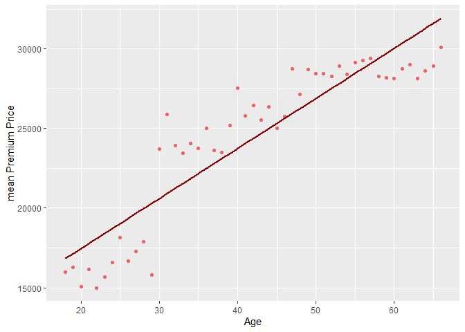<!-- -->

``` r
plt1 = ggplot(dt, mapping=aes(x=PremiumPrice, fill=KnownAllergies)) +
  geom_histogram(binwidth=2000, color="black") +
  scale_fill_manual(values=c("indianred2", "darkred")) +
  theme(legend.position = "none") +
  facet_wrap(~factor(KnownAllergies, levels=c(1, 0)), nrow=2) +
  labs(y="")
plt2 = ggplot(dt, mapping=aes(x=PremiumPrice, y=KnownAllergies, fill=KnownAllergies)) +
  geom_joy2(scale=0.8) +
  scale_fill_manual(values = c("indianred2", "darkred")) +
  theme(legend.position="none")
leg = get_legend(plt2 +
                   theme(legend.position = "bottom"))
```

    ## Picking joint bandwidth of 1540

``` r
cow1 = plot_grid(plt2, plt1, ncol=2, rel_heights=c(2, 1))
```

    ## Picking joint bandwidth of 1540

``` r
plot_grid(cow1 , leg, ncol=1, rel_heights = c(1, 0.1))
```

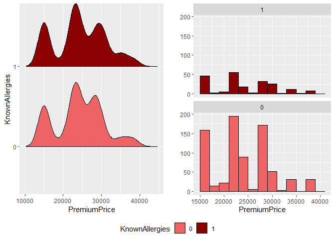<!-- -->

``` r
plt1 = ggplot(dt, mapping=aes(x=PremiumPrice, fill=BloodPressureProblems)) +
  geom_histogram(binwidth=2500, color="black") +
  scale_fill_manual(values=c("indianred2", "darkred")) +
  theme(legend.position = "none") +
  facet_wrap(~factor(BloodPressureProblems, levels=c(1, 0)), nrow=2) +
  labs(y="")
plt2 = ggplot(dt, mapping=aes(x=PremiumPrice, y=BloodPressureProblems, fill=BloodPressureProblems)) +
  geom_joy2(scale=0.8) +
  scale_fill_manual(values = c("indianred2", "darkred")) +
  theme(legend.position="none")
leg = get_legend(plt2 +
                   theme(legend.position = "bottom"))
```

    ## Picking joint bandwidth of 1340

``` r
cow1 = plot_grid(plt2, plt1, ncol=2, rel_heights=c(2, 1))
```

    ## Picking joint bandwidth of 1340

``` r
plot_grid(cow1 , leg, ncol=1, rel_heights = c(1, 0.1))
```

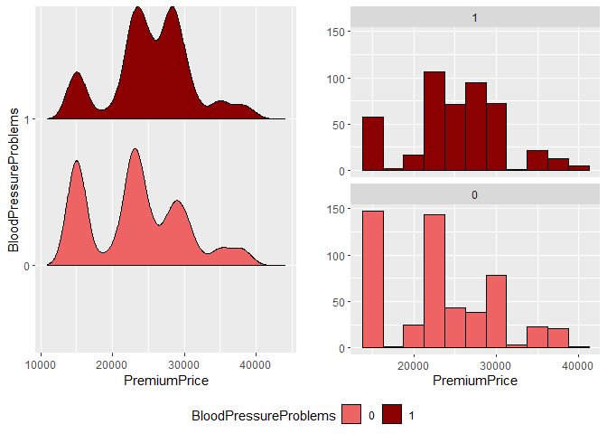<!-- -->

``` r
histBox = function(var, ...) {
  plt1 = ggplot(dt, aes(x=!!sym(var))) +
    geom_histogram(..., color="black", fill="darkred") +
    xlab("")
  
  plt2 = ggplot(dt, aes(x=!!sym(var))) +
    geom_boxplot(fill="indianred2", color="black")
  
  plt3 = title = ggdraw()+
    draw_label(glue("Histogram and Boxplot of {var}"))
  
  cow1 = plot_grid(plt1, plt2, ncol=1, rel_heights=c(2, 1), align='v', axis='lr')
  plot_grid(plt3, cow1, ncol=1, rel_heights = c(0.1, 1))
  
  }
```

``` r
histBox("Age", binwidth=1)
```

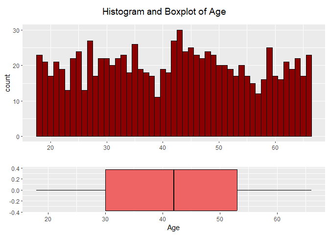<!-- -->

``` r
histBox("PremiumPrice", binwidth=2500)
```

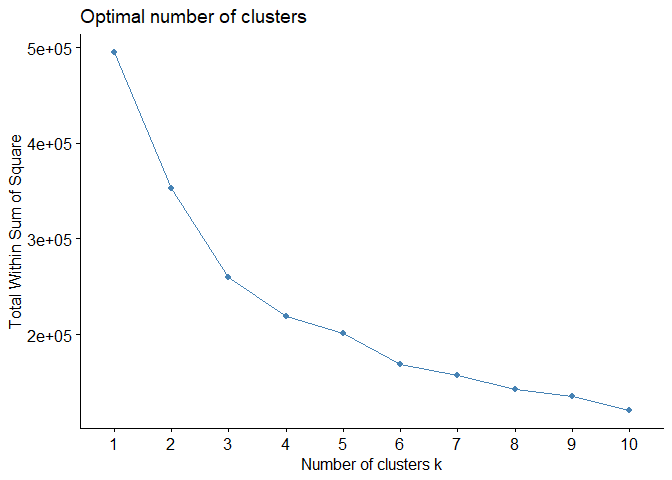<!-- -->

``` r
cat.cols = colnames(dq)[lapply(dq, class) == "factor"]
for (i in cat.cols) {
  plt = ggplot(dq, aes(x=!!sym(i), fill=!!sym(i))) +
    geom_bar() +
    scale_fill_brewer(palette="Set2")
  print(plt)
}
```

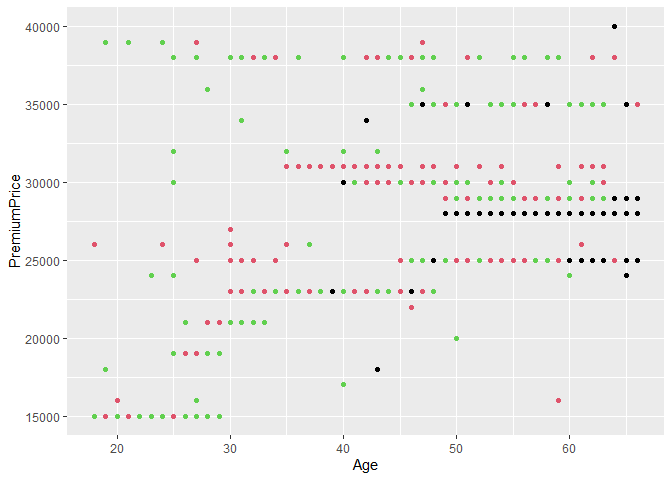<!-- -->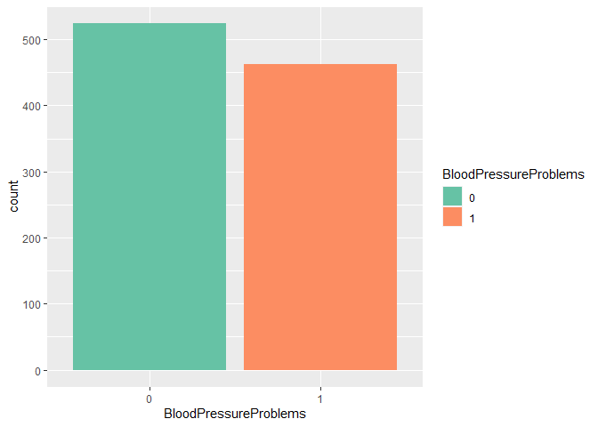<!-- -->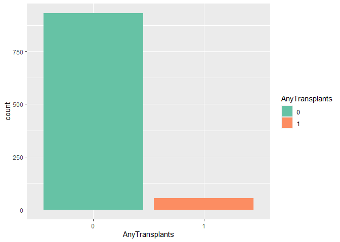<!-- --><!-- -->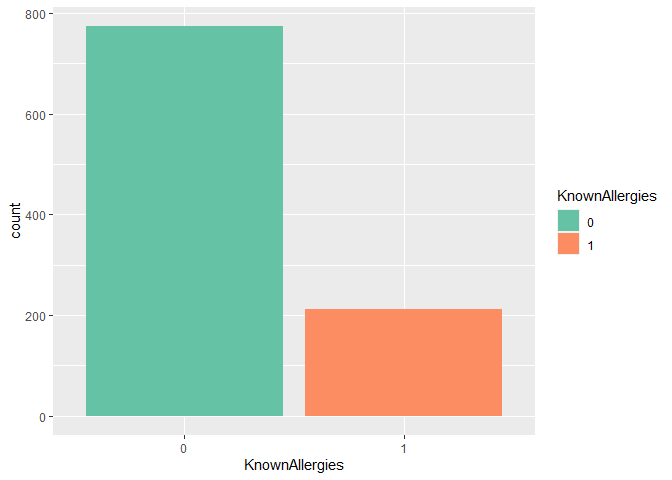<!-- -->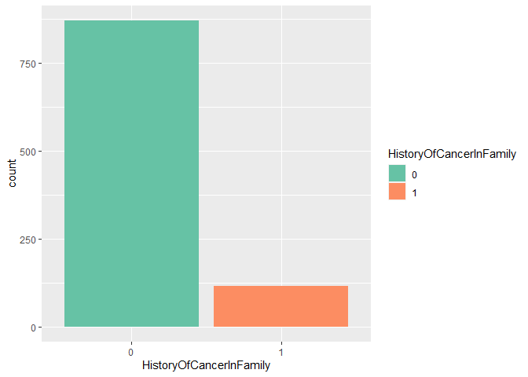<!-- -->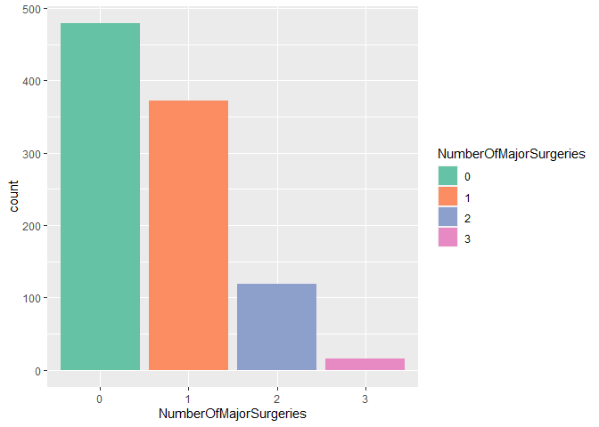<!-- -->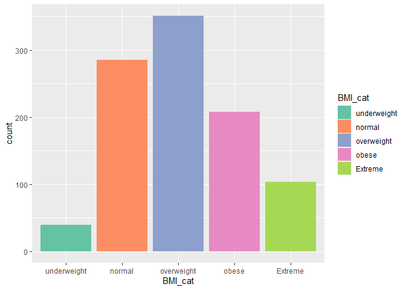<!-- --><!-- -->

``` r
for (i in num.cols) {
  plt = ggplot(dt, aes(y=!!sym(i))) +
    geom_boxplot(fill="coral", color="black") +
    scale_fill_brewer(palette="Set2")
  print(plt)
}
```

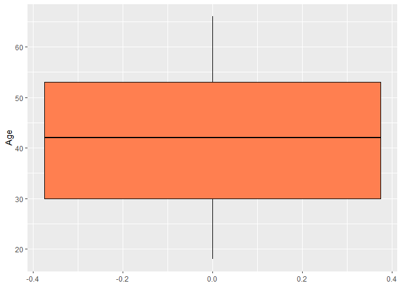<!-- -->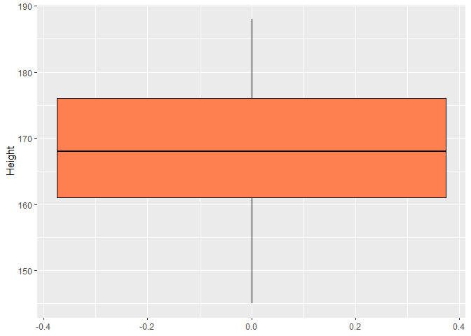<!-- -->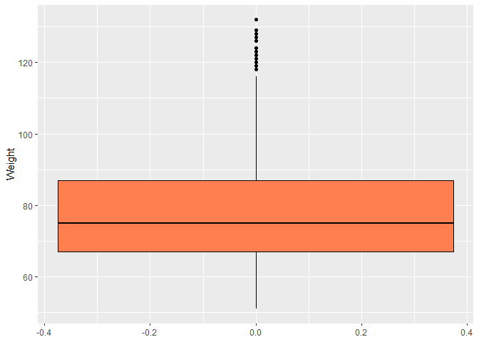<!-- -->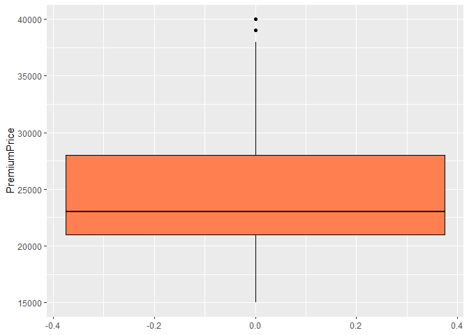<!-- -->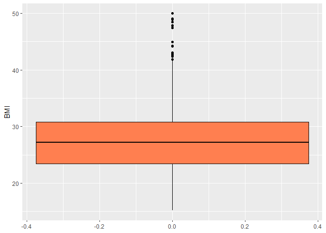<!-- -->

``` r
ggpairs(dt[, num.cols])
```

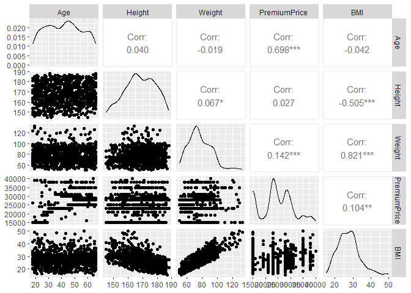<!-- -->

``` r
temp = num.cols[4]
num.cols[4] = num.cols[5]
num.cols[5] = temp
ggcorr(dt[, num.cols], label=T, label_round=3, low="white", mid="lightsalmon", high="darkred") +
  labs(title="Correlation Heatmap")
```

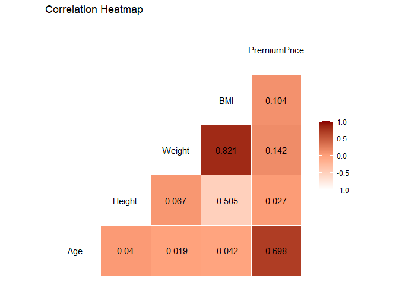<!-- -->

``` r
model = lm(PremiumPrice ~ ., data=df)         

as.data.frame(vif(model))
```

    ##                             GVIF Df GVIF^(1/(2*Df))
    ## Age                     1.367634  1        1.169459
    ## Diabetes                1.095770  1        1.046790
    ## BloodPressureProblems   1.147002  1        1.070982
    ## AnyTransplants          1.005659  1        1.002826
    ## AnyChronicDiseases      1.025579  1        1.012709
    ## Height                  1.013726  1        1.006840
    ## Weight                  1.013850  1        1.006901
    ## KnownAllergies          1.134309  1        1.065039
    ## HistoryOfCancerInFamily 1.200793  1        1.095807
    ## NumberOfMajorSurgeries  1.881248  3        1.111069

``` r
ggplot() +
  geom_bar(dq, mapping=aes(x=BMI_cat, fill=BloodPressureProblems), position="fill")
```

<!-- -->

``` r
ggplot() +
  geom_bar(dq, mapping=aes(x=BMI_cat, fill=BloodPressureProblems), position="fill")
```

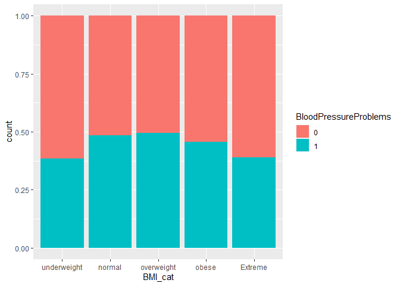<!-- -->

``` r
ggplot() +
  geom_bar(dq, mapping=aes(x=BMI_cat, fill=HistoryOfCancerInFamily), position="fill")
```

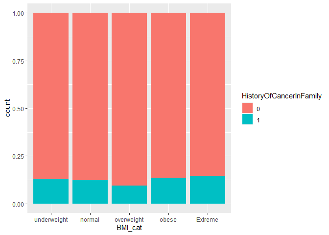<!-- -->

``` r
tble = table(dt$KnownAllergies, dt$HistoryOfCancerInFamily)
chisq.test(dt$AnyChronicDiseases, dt$HistoryOfCancerInFamily)
```

    ## 
    ##  Pearson's Chi-squared test with Yates' continuity correction
    ## 
    ## data:  dt$AnyChronicDiseases and dt$HistoryOfCancerInFamily
    ## X-squared = 0.020624, df = 1, p-value = 0.8858

``` r
temp = chisq.test(dt$Diabetes, dt$BloodPressureProblems)
temp$p.value
```

    ## [1] 7.945461e-05

``` r
chisq.test(dt$AnyChronicDiseases, dt$AnyChronicDiseases)
```

    ## 
    ##  Pearson's Chi-squared test with Yates' continuity correction
    ## 
    ## data:  dt$AnyChronicDiseases and dt$AnyChronicDiseases
    ## X-squared = 979.25, df = 1, p-value < 2.2e-16

``` r
balloonplot(tble, main ="housetasks", show.margins = FALSE)
```

<!-- -->

``` r
cat.cols = colnames(dt)[lapply(dt, class) == "factor"]
cat.cols = cat.cols[1:(length(cat.cols) - 1)]
mat = matrix(NA, nrow=length(cat.cols), ncol=length(cat.cols))
which(cat.cols == cat.cols[1])
```

    ## [1] 1

``` r
for (i in cat.cols) {
  for (j in cat.cols) {
    I = which(cat.cols == i)
    J = which(cat.cols == j)
    if (i == j) {
      mat[I, J] == 0
    } else {
      tb = table(dt[[i]], dt[[j]])
      print(tb)
      mat[I, J] = chisq.test(tb)$p.value
    }
  }
}
```

    ##    
    ##       0   1
    ##   0 335 237
    ##   1 189 225
    ##    
    ##       0   1
    ##   0 536  36
    ##   1 395  19
    ##    
    ##       0   1
    ##   0 452 120
    ##   1 356  58
    ##    
    ##       0   1
    ##   0 433 139
    ##   1 341  73
    ##    
    ##       0   1
    ##   0 496  76
    ##   1 374  40
    ##    
    ##       0   1   2   3
    ##   0 282 244  45   1
    ##   1 197 128  74  15
    ##    
    ##       0   1
    ##   0 335 189
    ##   1 237 225
    ##    
    ##       0   1
    ##   0 492  32
    ##   1 439  23
    ##    
    ##       0   1
    ##   0 438  86
    ##   1 370  92
    ##    
    ##       0   1
    ##   0 409 115
    ##   1 365  97
    ##    
    ##       0   1
    ##   0 470  54
    ##   1 400  62
    ##    
    ##       0   1   2   3
    ##   0 315 172  26  11
    ##   1 164 200  93   5
    ##    
    ##       0   1
    ##   0 536 395
    ##   1  36  19
    ##    
    ##       0   1
    ##   0 492 439
    ##   1  32  23
    ##    
    ##       0   1
    ##   0 766 165
    ##   1  42  13
    ##    
    ##       0   1
    ##   0 731 200
    ##   1  43  12
    ##    
    ##       0   1
    ##   0 820 111
    ##   1  50   5
    ##    
    ##       0   1   2   3
    ##   0 453 349 114  15
    ##   1  26  23   5   1

    ## Warning in chisq.test(tb): Chi-squared approximation may be incorrect

    ##    
    ##       0   1
    ##   0 452 356
    ##   1 120  58
    ##    
    ##       0   1
    ##   0 438 370
    ##   1  86  92
    ##    
    ##       0   1
    ##   0 766  42
    ##   1 165  13
    ##    
    ##       0   1
    ##   0 630 178
    ##   1 144  34
    ##    
    ##       0   1
    ##   0 714  94
    ##   1 156  22
    ##    
    ##       0   1   2   3
    ##   0 396 305  91  16
    ##   1  83  67  28   0

    ## Warning in chisq.test(tb): Chi-squared approximation may be incorrect

    ##    
    ##       0   1
    ##   0 433 341
    ##   1 139  73
    ##    
    ##       0   1
    ##   0 409 365
    ##   1 115  97
    ##    
    ##       0   1
    ##   0 731  43
    ##   1 200  12
    ##    
    ##       0   1
    ##   0 630 144
    ##   1 178  34
    ##    
    ##       0   1
    ##   0 698  76
    ##   1 172  40
    ##    
    ##       0   1   2   3
    ##   0 426 227 105  16
    ##   1  53 145  14   0

    ## Warning in chisq.test(tb): Chi-squared approximation may be incorrect

    ##    
    ##       0   1
    ##   0 496 374
    ##   1  76  40
    ##    
    ##       0   1
    ##   0 470 400
    ##   1  54  62
    ##    
    ##       0   1
    ##   0 820  50
    ##   1 111   5
    ##    
    ##       0   1
    ##   0 714 156
    ##   1  94  22
    ##    
    ##       0   1
    ##   0 698 172
    ##   1  76  40
    ##    
    ##       0   1   2   3
    ##   0 479 268 107  16
    ##   1   0 104  12   0

    ## Warning in chisq.test(tb): Chi-squared approximation may be incorrect

    ##    
    ##       0   1
    ##   0 282 197
    ##   1 244 128
    ##   2  45  74
    ##   3   1  15
    ##    
    ##       0   1
    ##   0 315 164
    ##   1 172 200
    ##   2  26  93
    ##   3  11   5
    ##    
    ##       0   1
    ##   0 453  26
    ##   1 349  23
    ##   2 114   5
    ##   3  15   1

    ## Warning in chisq.test(tb): Chi-squared approximation may be incorrect

    ##    
    ##       0   1
    ##   0 396  83
    ##   1 305  67
    ##   2  91  28
    ##   3  16   0

    ## Warning in chisq.test(tb): Chi-squared approximation may be incorrect

    ##    
    ##       0   1
    ##   0 426  53
    ##   1 227 145
    ##   2 105  14
    ##   3  16   0

    ## Warning in chisq.test(tb): Chi-squared approximation may be incorrect

    ##    
    ##       0   1
    ##   0 479   0
    ##   1 268 104
    ##   2 107  12
    ##   3  16   0

    ## Warning in chisq.test(tb): Chi-squared approximation may be incorrect

``` r
mat
```

    ##              [,1]         [,2]      [,3]        [,4]         [,5]         [,6]
    ## [1,]           NA 7.945461e-05 0.3123461 0.006445249 1.482058e-02 1.002919e-01
    ## [2,] 7.945461e-05           NA 0.5277361 0.179145560 7.756406e-01 1.568669e-01
    ## [3,] 3.123461e-01 5.277361e-01        NA 0.353633037 1.000000e+00 6.759265e-01
    ## [4,] 6.445249e-03 1.791456e-01 0.3536330          NA 4.471532e-01 8.858082e-01
    ## [5,] 1.482058e-02 7.756406e-01 1.0000000 0.447153166           NA 4.604050e-04
    ## [6,] 1.002919e-01 1.568669e-01 0.6759265 0.885808164 4.604050e-04           NA
    ## [7,] 4.556699e-10 1.489349e-18 0.8683679 0.106469072 1.550996e-23 1.593026e-34
    ##              [,7]
    ## [1,] 4.556699e-10
    ## [2,] 1.489349e-18
    ## [3,] 8.683679e-01
    ## [4,] 1.064691e-01
    ## [5,] 1.550996e-23
    ## [6,] 1.593026e-34
    ## [7,]           NA

``` r
chi = as.data.frame(mat)
names(chi) = cat.cols
rownames(chi) = cat.cols
which(cat.cols == "HistoryOfCancerInFamily")
```

    ## [1] 6

``` r
which(cat.cols == "KnownAllergies")
```

    ## [1] 5

``` r
chi[6, 5] = 0
chi[5, 6] = 0
chi
```

    ##                             Diabetes BloodPressureProblems AnyTransplants
    ## Diabetes                          NA          7.945461e-05      0.3123461
    ## BloodPressureProblems   7.945461e-05                    NA      0.5277361
    ## AnyTransplants          3.123461e-01          5.277361e-01             NA
    ## AnyChronicDiseases      6.445249e-03          1.791456e-01      0.3536330
    ## KnownAllergies          1.482058e-02          7.756406e-01      1.0000000
    ## HistoryOfCancerInFamily 1.002919e-01          1.568669e-01      0.6759265
    ## NumberOfMajorSurgeries  4.556699e-10          1.489349e-18      0.8683679
    ##                         AnyChronicDiseases KnownAllergies
    ## Diabetes                       0.006445249   1.482058e-02
    ## BloodPressureProblems          0.179145560   7.756406e-01
    ## AnyTransplants                 0.353633037   1.000000e+00
    ## AnyChronicDiseases                      NA   4.471532e-01
    ## KnownAllergies                 0.447153166             NA
    ## HistoryOfCancerInFamily        0.885808164   0.000000e+00
    ## NumberOfMajorSurgeries         0.106469072   1.550996e-23
    ##                         HistoryOfCancerInFamily NumberOfMajorSurgeries
    ## Diabetes                           1.002919e-01           4.556699e-10
    ## BloodPressureProblems              1.568669e-01           1.489349e-18
    ## AnyTransplants                     6.759265e-01           8.683679e-01
    ## AnyChronicDiseases                 8.858082e-01           1.064691e-01
    ## KnownAllergies                     0.000000e+00           1.550996e-23
    ## HistoryOfCancerInFamily                      NA           1.593026e-34
    ## NumberOfMajorSurgeries             1.593026e-34                     NA

``` r
ggcorr(chi, label = T, label_round = 3, hjust=0.7, size=3, cor_matrix = chi)
```

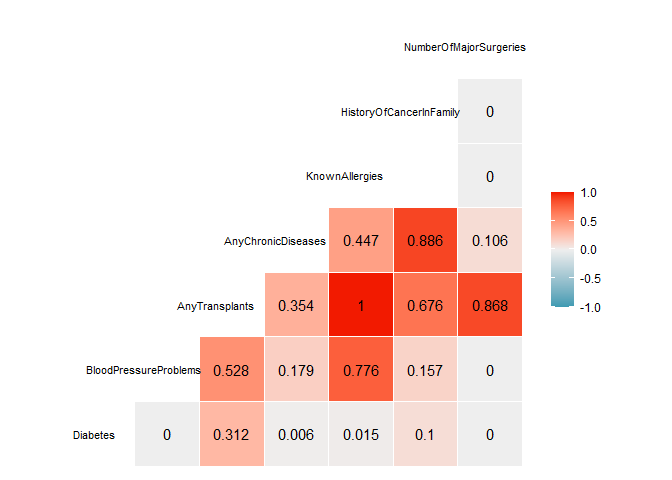<!-- -->

``` r
ggplot() +
  geom_bar(dq, mapping=aes(x=dt$BloodPressureProblems, fill=dt$Diabetes), position="fill")
```

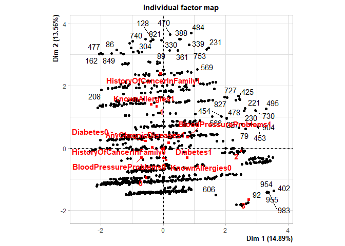<!-- -->

``` r
temp = dq %>% 
  group_by(AnyChronicDiseases) %>%
  summarise(mean_age=mean(Age)) %>%
  arrange(desc(mean_age))
  
ggplot(temp, aes(x=AnyChronicDiseases, y=mean_age, fill=AnyChronicDiseases)) +
    geom_bar(stat="identity") +
    scale_fill_manual(values = cols) +
    labs(y="mean Premium Age")
```

<!-- -->

``` r
ggplot(dq, aes(x=AnyChronicDiseases, fill=Age_cat)) +
  geom_bar(position = "fill")
```

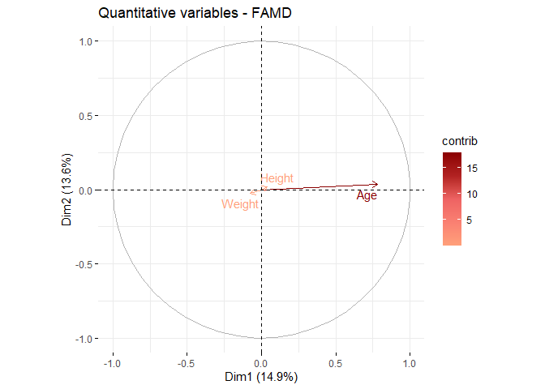<!-- -->

``` r
temp = num.cols[5]
q1 = quantile(df[[temp]], 0.25)
q3 = quantile(df[[temp]], 0.75)
IQR = q3 - q1
lb = q1 - 1.5*IQR
ub = q3 + 1.5*IQR
lb
```

    ##   25% 
    ## 10500

``` r
ub
```

    ##   75% 
    ## 38500

``` r
df[df[[temp]] < lb | df[[temp]] > ub, ]
```

    ## # A tibble: 6 × 11
    ##     Age Diabetes BloodPressureProblems AnyTransplants AnyChronicDiseases Height
    ##   <dbl> <fct>    <fct>                 <fct>          <fct>               <dbl>
    ## 1    27 0        1                     0              0                     159
    ## 2    64 1        1                     0              1                     163
    ## 3    24 0        1                     0              0                     159
    ## 4    19 0        0                     0              0                     171
    ## 5    21 0        1                     0              0                     155
    ## 6    47 1        1                     0              0                     158
    ## # ℹ 5 more variables: Weight <dbl>, KnownAllergies <fct>,
    ## #   HistoryOfCancerInFamily <fct>, NumberOfMajorSurgeries <fct>,
    ## #   PremiumPrice <dbl>

``` r
dtemp = dt
dtemp$ID = row.names(dtemp)
dtemp
```

    ## # A tibble: 986 × 14
    ##      Age Diabetes BloodPressureProblems AnyTransplants AnyChronicDiseases Height
    ##    <dbl> <fct>    <fct>                 <fct>          <fct>               <dbl>
    ##  1    45 0        0                     0              0                     155
    ##  2    60 1        0                     0              0                     180
    ##  3    36 1        1                     0              0                     158
    ##  4    52 1        1                     0              1                     183
    ##  5    38 0        0                     0              1                     166
    ##  6    30 0        0                     0              0                     160
    ##  7    33 0        0                     0              0                     150
    ##  8    23 0        0                     0              0                     181
    ##  9    48 1        0                     0              0                     169
    ## 10    38 0        0                     0              0                     182
    ## # ℹ 976 more rows
    ## # ℹ 8 more variables: Weight <dbl>, KnownAllergies <fct>,
    ## #   HistoryOfCancerInFamily <fct>, NumberOfMajorSurgeries <fct>,
    ## #   PremiumPrice <dbl>, BMI <dbl>, BMI_cat <fct>, ID <chr>

``` r
temp = num.cols[-4]
temp
```

    ## [1] "Age"          "Height"       "Weight"       "PremiumPrice"

``` r
identify_outliers_in_all_variables <- function(data, k = 1.5) {
  outliers <- data.frame()

  for (column in names(data)) {
    if (column %in% temp) {
      # Calculate IQR for each variable
      Q1 <- quantile(data[[column]], 0.25)
      Q3 <- quantile(data[[column]], 0.75)
      IQR <- Q3 - Q1

      # Define upper and lower bounds
      lower_bound <- Q1 - k * IQR
      upper_bound <- Q3 + k * IQR

      # Identify outliers for the current variable
      variable_outliers <- data[(data[[column]] < lower_bound) | (data[[column]] > upper_bound), ]

      # Add to the overall outliers dataframe
      outliers <- rbind(outliers, variable_outliers)
    }
  }

  # Keep only rows where all numeric variables are outliers
  outliers <- outliers[duplicated(outliers), ]

  return(outliers)
}

identify_outliers_in_all_variables(dtemp)
```

    ## # A tibble: 1 × 14
    ##     Age Diabetes BloodPressureProblems AnyTransplants AnyChronicDiseases Height
    ##   <dbl> <fct>    <fct>                 <fct>          <fct>               <dbl>
    ## 1    27 0        1                     0              0                     159
    ## # ℹ 8 more variables: Weight <dbl>, KnownAllergies <fct>,
    ## #   HistoryOfCancerInFamily <fct>, NumberOfMajorSurgeries <fct>,
    ## #   PremiumPrice <dbl>, BMI <dbl>, BMI_cat <fct>, ID <chr>

## FAMD

## FAMD with original data

``` r
X = df[, -dim(df)[2]]
y = df[, dim(df)[2]]
```

``` r
X.copy = X
cat.cols = colnames(X)[lapply(X, class) == "factor"]
cat.cols = cat.cols[1:(length(cat.cols) -1)]
for (col in cat.cols) {
  X[[col]] = recode_factor(X[[col]], "0" = paste0(col, "0"),
                           "1" = paste0(col, "1"))
}
```

``` r
X
```

    ## # A tibble: 986 × 10
    ##      Age Diabetes BloodPressureProblems AnyTransplants AnyChronicDiseases Height
    ##    <dbl> <fct>    <fct>                 <fct>          <fct>               <dbl>
    ##  1    45 Diabete… BloodPressureProblem… AnyTransplant… AnyChronicDisease…    155
    ##  2    60 Diabete… BloodPressureProblem… AnyTransplant… AnyChronicDisease…    180
    ##  3    36 Diabete… BloodPressureProblem… AnyTransplant… AnyChronicDisease…    158
    ##  4    52 Diabete… BloodPressureProblem… AnyTransplant… AnyChronicDisease…    183
    ##  5    38 Diabete… BloodPressureProblem… AnyTransplant… AnyChronicDisease…    166
    ##  6    30 Diabete… BloodPressureProblem… AnyTransplant… AnyChronicDisease…    160
    ##  7    33 Diabete… BloodPressureProblem… AnyTransplant… AnyChronicDisease…    150
    ##  8    23 Diabete… BloodPressureProblem… AnyTransplant… AnyChronicDisease…    181
    ##  9    48 Diabete… BloodPressureProblem… AnyTransplant… AnyChronicDisease…    169
    ## 10    38 Diabete… BloodPressureProblem… AnyTransplant… AnyChronicDisease…    182
    ## # ℹ 976 more rows
    ## # ℹ 4 more variables: Weight <dbl>, KnownAllergies <fct>,
    ## #   HistoryOfCancerInFamily <fct>, NumberOfMajorSurgeries <fct>

``` r
res.famd = FAMD(X)
```

    ## Warning: ggrepel: 947 unlabeled data points (too many overlaps). Consider
    ## increasing max.overlaps

    ## Warning: ggrepel: 3 unlabeled data points (too many overlaps). Consider
    ## increasing max.overlaps

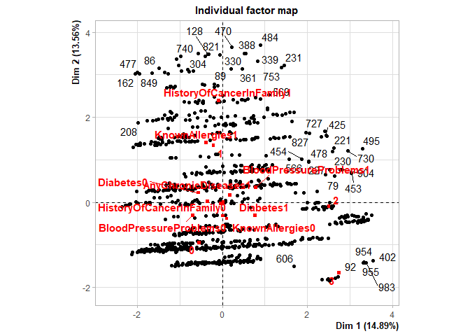<!-- -->

    ## Warning: ggrepel: 947 unlabeled data points (too many overlaps). Consider
    ## increasing max.overlaps

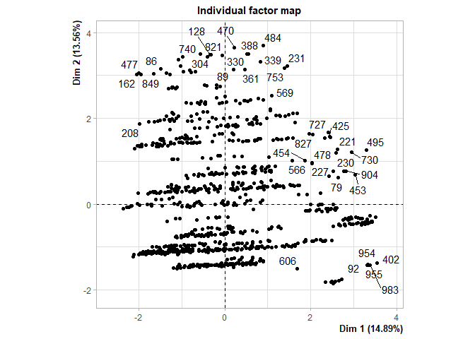<!-- --><!-- -->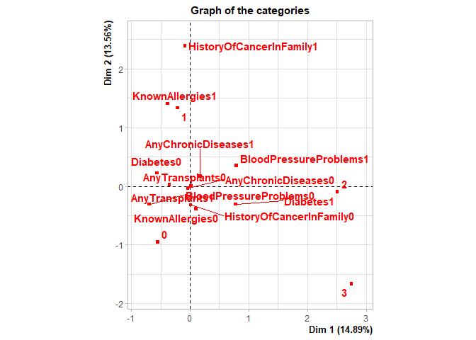<!-- -->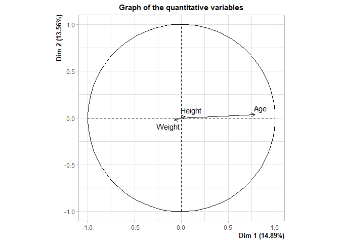<!-- -->

``` r
res.famd$var$contrib
```

    ##                               Dim.1       Dim.2      Dim.3        Dim.4
    ## Age                     34.29979649  0.08309141  0.2237468 1.284760e+00
    ## Height                   0.08930916  0.02074642  1.2932686 4.886493e+01
    ## Weight                   0.31253870  0.04140843  8.4106580 2.699783e+01
    ## Diabetes                13.61050815  2.59666852  8.9353069 4.317267e+00
    ## BloodPressureProblems   17.21288673  4.01508421  6.1835852 2.951946e+00
    ## AnyTransplants           0.22879871  0.00095201  2.0292692 2.735123e-04
    ## AnyChronicDiseases       0.20407447  0.23710630 33.8658847 1.384934e+01
    ## KnownAllergies           1.26511682 20.46190964  3.1395362 4.161154e-03
    ## HistoryOfCancerInFamily  0.03092676 28.74530678  0.7050613 2.912946e-03
    ## NumberOfMajorSurgeries  32.74604401 43.79772626 35.2136831 1.726587e+00
    ##                              Dim.5
    ## Age                      1.6871700
    ## Height                   1.9912871
    ## Weight                   0.2672856
    ## Diabetes                 0.4752369
    ## BloodPressureProblems    1.6452753
    ## AnyTransplants          74.2720248
    ## AnyChronicDiseases       3.1692790
    ## KnownAllergies           0.2514646
    ## HistoryOfCancerInFamily  0.2538051
    ## NumberOfMajorSurgeries  15.9871716

``` r
fviz_famd_var(res.famd, "quanti.var", repel=T, col.var="contrib", gradient.cols=rev(cols))
```

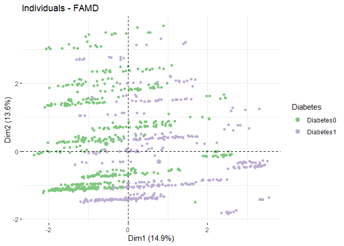<!-- -->

``` r
fviz_famd_var(res.famd, "quali.var", repel=T, col.var="contrib", gradient.cols=rev(cols))
```

<!-- -->

``` r
fviz_famd_var(res.famd, "var", repel=T, col.var="coord", gradient.cols=rev(cols))
```

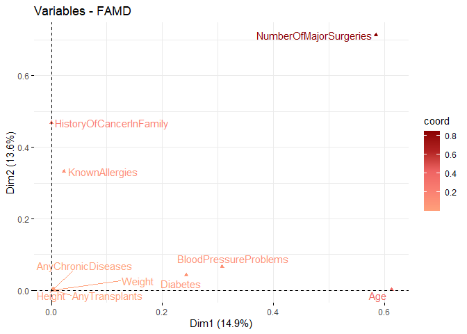<!-- -->

``` r
fviz_screeplot(res.famd)
```

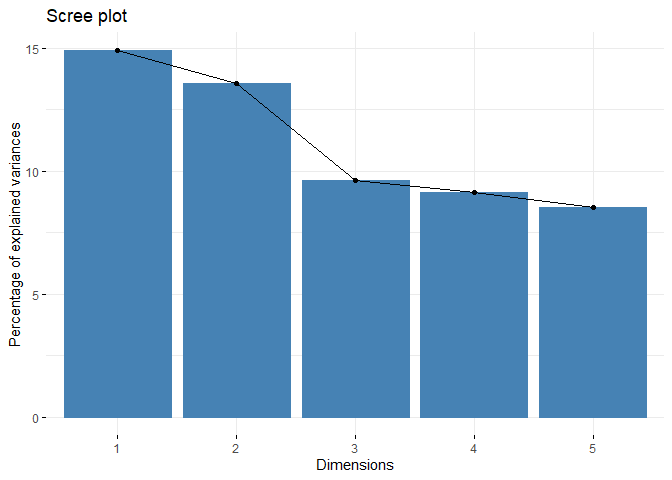<!-- -->

``` r
as.data.frame(res.famd$eig)
```

    ##        eigenvalue percentage of variance cumulative percentage of variance
    ## comp 1   1.787189              14.893244                          14.89324
    ## comp 2   1.627318              13.560983                          28.45423
    ## comp 3   1.156018               9.633485                          38.08771
    ## comp 4   1.096156               9.134633                          47.22234
    ## comp 5   1.024013               8.533443                          55.75579

``` r
res.famd$var$contrib[, 1:2]
```

    ##                               Dim.1       Dim.2
    ## Age                     34.29979649  0.08309141
    ## Height                   0.08930916  0.02074642
    ## Weight                   0.31253870  0.04140843
    ## Diabetes                13.61050815  2.59666852
    ## BloodPressureProblems   17.21288673  4.01508421
    ## AnyTransplants           0.22879871  0.00095201
    ## AnyChronicDiseases       0.20407447  0.23710630
    ## KnownAllergies           1.26511682 20.46190964
    ## HistoryOfCancerInFamily  0.03092676 28.74530678
    ## NumberOfMajorSurgeries  32.74604401 43.79772626

``` r
fviz_mfa_ind(res.famd, geom="point", habillage = "BloodPressureProblems")
```

<!-- -->

``` r
fviz_mfa_ind(res.famd, habillage="Diabetes", palette="Accent", addEllipses=F, repel=T, geom="point")
```

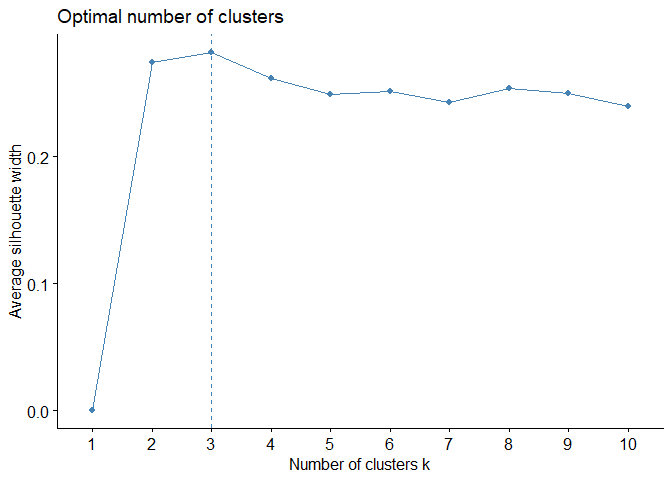<!-- -->

``` r
res.km = kmeans(res.famd$ind$coord, centers=3, nstart=25, iter.max=50)
fviz_mfa_ind(res.famd, habillage=as.factor(res.km$cluster), palette=c("darkred", "indianred2", "salmon"), addEllipses=T, repel=T, geom="point")
```

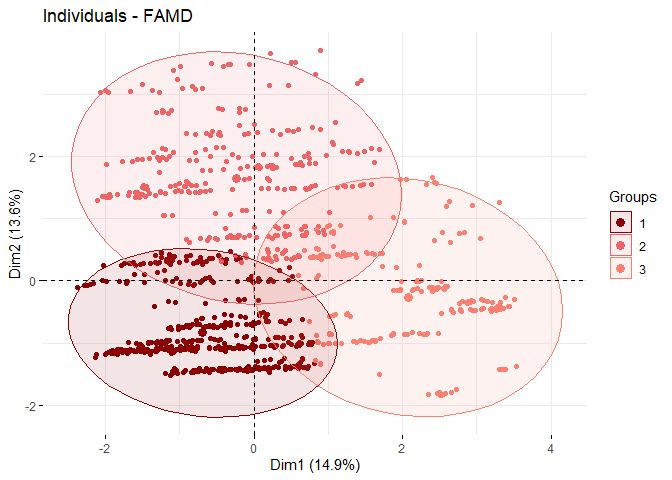<!-- -->

``` r
dt["cluster"] = as.factor(res.km$cluster)
dq["cluster"] = as.factor(res.km$cluster)

fviz_nbclust(X.copy, kmeans, method = "silhouette")
```

<!-- -->

``` r
ggplot(dt, aes(x=cluster, y=PremiumPrice, color=cluster)) +
  geom_jitter() +
  labs(title="Visualizing clusters against Premium price")
```

<!-- -->

``` r
ggplot(dt, aes(x=cluster, y=Age, color=cluster)) +
  geom_jitter() +
  labs(title="Visualizing clusters against Premium price")
```

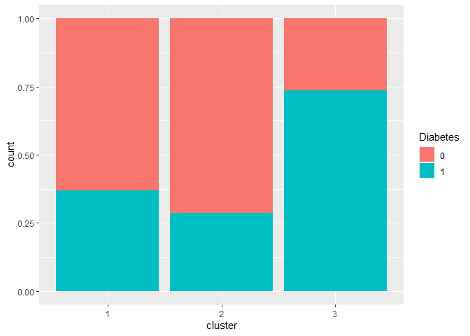<!-- -->

``` r
ggplot(dt, aes(x=Age, y=PremiumPrice, color=as.factor(cluster))) +
  geom_point()
```

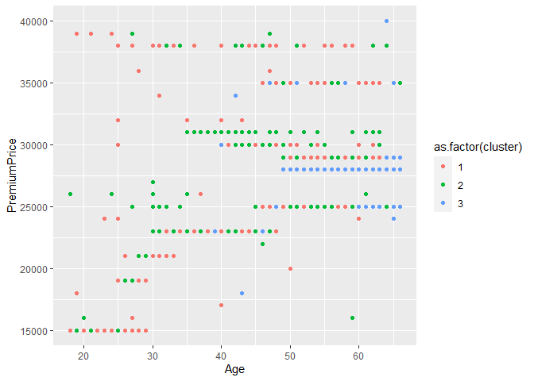<!-- -->

``` r
X.exp = X
X.exp$cluster = dt$cluster
X.exp = X.exp[, -which(colnames(X.exp) %in% c("Height", "Weight", "Age"))]
temp = as.data.frame(table(X.exp$cluster, X.exp$Diabetes))
temp
```

    ##   Var1      Var2 Freq
    ## 1    1 Diabetes0  316
    ## 2    2 Diabetes0  203
    ## 3    3 Diabetes0   53
    ## 4    1 Diabetes1  185
    ## 5    2 Diabetes1   82
    ## 6    3 Diabetes1  147

``` r
temp = spread(temp, key=Var2, value=Freq)
temp[, -1] = round(temp[, -1] / rowSums(temp[, -1]), 2)
temp
```

    ##   Var1 Diabetes0 Diabetes1
    ## 1    1      0.63      0.37
    ## 2    2      0.71      0.29
    ## 3    3      0.26      0.74

``` r
for (i in colnames(X.exp)[-8]) {
  temp = as.data.frame(table(X.exp$cluster, X.exp[[i]]))
  temp =spread(temp, key=Var2, value=Freq)
  temp[, -1] = round(temp[, -1] / rowSums(temp[, -1]), 2)
  print(temp)
  if (which(colnames(X.exp) == i) == 1) {
    emp = temp
  } else {
    emp = merge(emp, temp, by="Var1")
  }
}
```

    ##   Var1 Diabetes0 Diabetes1
    ## 1    1      0.63      0.37
    ## 2    2      0.71      0.29
    ## 3    3      0.26      0.74
    ##   Var1 BloodPressureProblems0 BloodPressureProblems1
    ## 1    1                   0.74                   0.26
    ## 2    2                   0.40                   0.60
    ## 3    3                   0.20                   0.80
    ##   Var1 AnyTransplants0 AnyTransplants1
    ## 1    1            0.94            0.06
    ## 2    2            0.94            0.06
    ## 3    3            0.96            0.04
    ##   Var1 AnyChronicDiseases0 AnyChronicDiseases1
    ## 1    1                0.83                0.17
    ## 2    2                0.82                0.18
    ## 3    3                0.79                0.21
    ##   Var1 KnownAllergies0 KnownAllergies1
    ## 1    1            0.91            0.09
    ## 2    2            0.46            0.54
    ## 3    3            0.92            0.08
    ##   Var1 HistoryOfCancerInFamily0 HistoryOfCancerInFamily1
    ## 1    1                     1.00                     0.00
    ## 2    2                     0.63                     0.37
    ## 3    3                     0.95                     0.05
    ##   Var1    0    1    2    3
    ## 1    1 0.88 0.12 0.00 0.00
    ## 2    2 0.02 0.97 0.01 0.00
    ## 3    3 0.16 0.17 0.58 0.08

``` r
print(emp)
```

    ##   Var1 Diabetes0 Diabetes1 BloodPressureProblems0 BloodPressureProblems1
    ## 1    1      0.63      0.37                   0.74                   0.26
    ## 2    2      0.71      0.29                   0.40                   0.60
    ## 3    3      0.26      0.74                   0.20                   0.80
    ##   AnyTransplants0 AnyTransplants1 AnyChronicDiseases0 AnyChronicDiseases1
    ## 1            0.94            0.06                0.83                0.17
    ## 2            0.94            0.06                0.82                0.18
    ## 3            0.96            0.04                0.79                0.21
    ##   KnownAllergies0 KnownAllergies1 HistoryOfCancerInFamily0
    ## 1            0.91            0.09                     1.00
    ## 2            0.46            0.54                     0.63
    ## 3            0.92            0.08                     0.95
    ##   HistoryOfCancerInFamily1    0    1    2    3
    ## 1                     0.00 0.88 0.12 0.00 0.00
    ## 2                     0.37 0.02 0.97 0.01 0.00
    ## 3                     0.05 0.16 0.17 0.58 0.08

``` r
ggplot() +
  geom_bar(dq, mapping=aes(x=cluster, fill=Age_cat), position="fill")
```

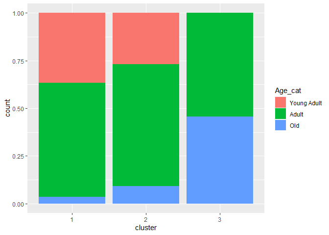<!-- -->

``` r
ggplot() +
  geom_bar(dt, mapping=aes(x=cluster, fill=Diabetes), position="fill")
```

<!-- -->

``` r
cat.cols = colnames(dt)[lapply(dt, class) == "factor"]
cat.cols = cat.cols[1:(length(cat.cols) - 1)]

for (i in cat.cols) {
  plt = ggplot(dt, aes(x=cluster, fill=!!sym(i))) +
    geom_bar(position="fill") +
    scale_fill_brewer(palette="Set2")
  print(plt)
}
```

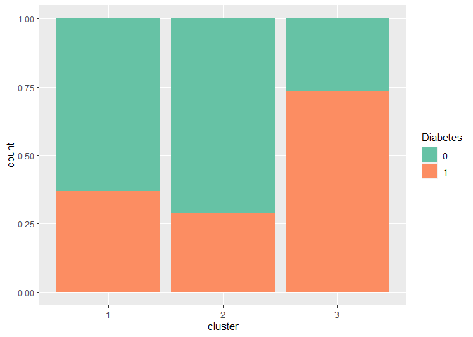<!-- -->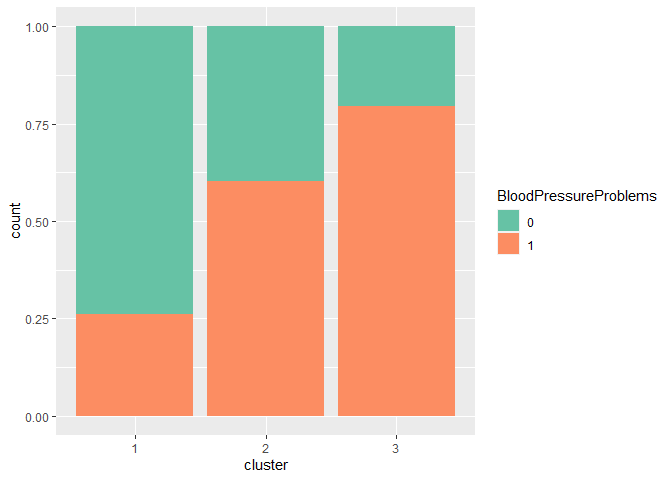<!-- -->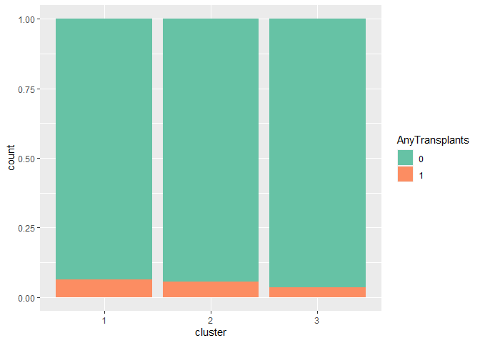<!-- -->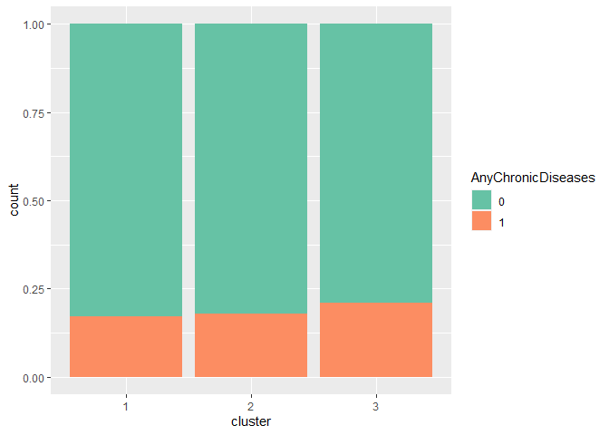<!-- --><!-- -->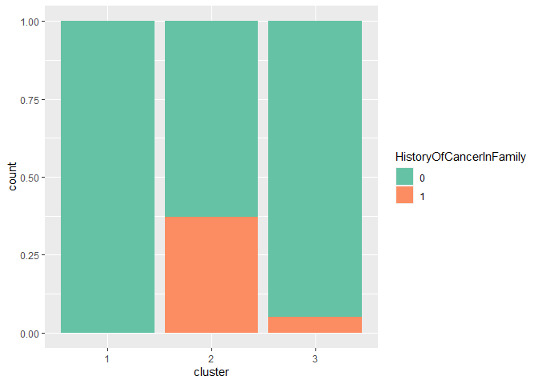<!-- -->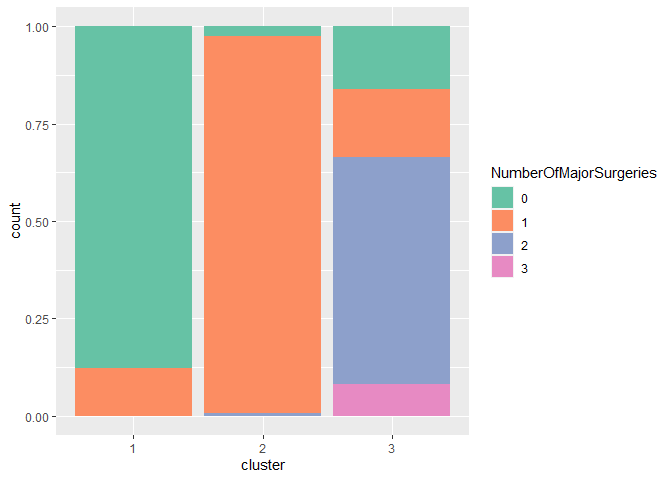<!-- -->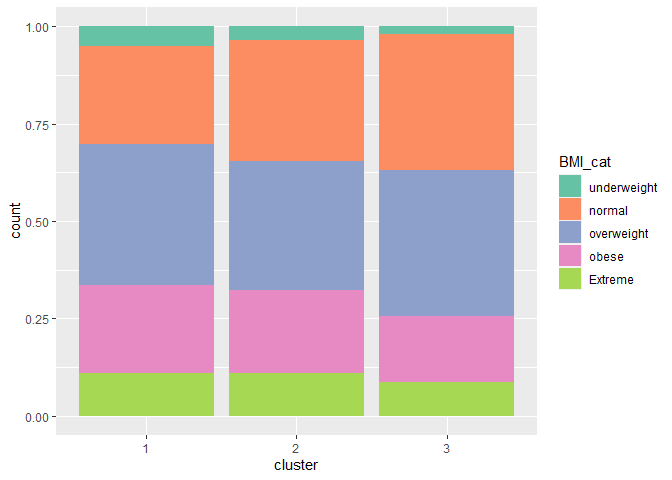<!-- -->

``` r
temp = dt %>%
  group_by(cluster, NumberOfMajorSurgeries) %>%
  count()
temp
```

    ## # A tibble: 9 × 3
    ## # Groups:   cluster, NumberOfMajorSurgeries [9]
    ##   cluster NumberOfMajorSurgeries     n
    ##   <fct>   <fct>                  <int>
    ## 1 1       0                        440
    ## 2 1       1                         61
    ## 3 2       0                          7
    ## 4 2       1                        276
    ## 5 2       2                          2
    ## 6 3       0                         32
    ## 7 3       1                         35
    ## 8 3       2                        117
    ## 9 3       3                         16

``` r
ggplot() +
  geom_bar(temp, mapping=aes(x=cluster, y=n, fill=NumberOfMajorSurgeries),
                             position="dodge", stat="identity")
```

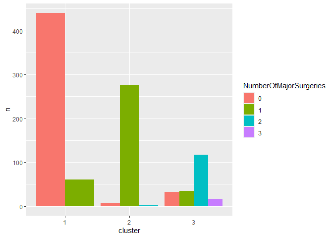<!-- -->

``` r
temp = dt[, c(cat.cols, "cluster")]
summary(temp[temp$cluster == 1, ])
```

    ##  Diabetes BloodPressureProblems AnyTransplants AnyChronicDiseases
    ##  0:316    0:370                 0:469          0:416             
    ##  1:185    1:131                 1: 32          1: 85             
    ##                                                                  
    ##                                                                  
    ##                                                                  
    ##  KnownAllergies HistoryOfCancerInFamily NumberOfMajorSurgeries
    ##  0:458          0:501                   0:440                 
    ##  1: 43          1:  0                   1: 61                 
    ##                                         2:  0                 
    ##                                         3:  0                 
    ##                                                               
    ##         BMI_cat    cluster
    ##  underweight: 25   1:501  
    ##  normal     :126   2:  0  
    ##  overweight :182   3:  0  
    ##  obese      :113          
    ##  Extreme    : 55

``` r
summary(temp[temp$cluster == 2, ])
```

    ##  Diabetes BloodPressureProblems AnyTransplants AnyChronicDiseases
    ##  0:203    0:113                 0:269          0:234             
    ##  1: 82    1:172                 1: 16          1: 51             
    ##                                                                  
    ##                                                                  
    ##                                                                  
    ##  KnownAllergies HistoryOfCancerInFamily NumberOfMajorSurgeries        BMI_cat  
    ##  0:132          0:179                   0:  7                  underweight:10  
    ##  1:153          1:106                   1:276                  normal     :89  
    ##                                         2:  2                  overweight :94  
    ##                                         3:  0                  obese      :61  
    ##                                                                Extreme    :31  
    ##  cluster
    ##  1:  0  
    ##  2:285  
    ##  3:  0  
    ##         
    ## 

``` r
summary(temp[temp$cluster == 3, ])
```

    ##  Diabetes BloodPressureProblems AnyTransplants AnyChronicDiseases
    ##  0: 53    0: 41                 0:193          0:158             
    ##  1:147    1:159                 1:  7          1: 42             
    ##                                                                  
    ##                                                                  
    ##                                                                  
    ##  KnownAllergies HistoryOfCancerInFamily NumberOfMajorSurgeries        BMI_cat  
    ##  0:184          0:190                   0: 32                  underweight: 4  
    ##  1: 16          1: 10                   1: 35                  normal     :70  
    ##                                         2:117                  overweight :75  
    ##                                         3: 16                  obese      :34  
    ##                                                                Extreme    :17  
    ##  cluster
    ##  1:  0  
    ##  2:  0  
    ##  3:200  
    ##         
    ## 

## hierachical clustering with original data

``` r
res.hcpc = HCPC(res.famd, graph=F, nb.clust=2)
```

``` r
fviz_cluster(res.hcpc, geom="point")
```

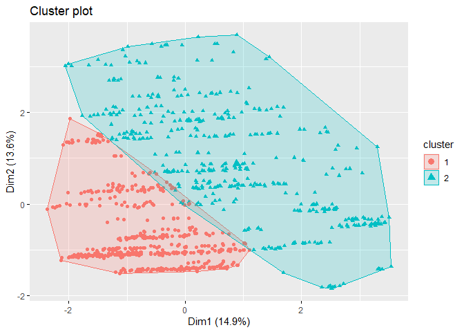<!-- -->

``` r
clust = res.hcpc$data.clust
dt["cluster"] = clust$clust
dt
```

    ## # A tibble: 986 × 14
    ##      Age Diabetes BloodPressureProblems AnyTransplants AnyChronicDiseases Height
    ##    <dbl> <fct>    <fct>                 <fct>          <fct>               <dbl>
    ##  1    45 0        0                     0              0                     155
    ##  2    60 1        0                     0              0                     180
    ##  3    36 1        1                     0              0                     158
    ##  4    52 1        1                     0              1                     183
    ##  5    38 0        0                     0              1                     166
    ##  6    30 0        0                     0              0                     160
    ##  7    33 0        0                     0              0                     150
    ##  8    23 0        0                     0              0                     181
    ##  9    48 1        0                     0              0                     169
    ## 10    38 0        0                     0              0                     182
    ## # ℹ 976 more rows
    ## # ℹ 8 more variables: Weight <dbl>, KnownAllergies <fct>,
    ## #   HistoryOfCancerInFamily <fct>, NumberOfMajorSurgeries <fct>,
    ## #   PremiumPrice <dbl>, BMI <dbl>, BMI_cat <fct>, cluster <fct>

``` r
ggplot(dt, aes(x=cluster, y=PremiumPrice)) +
  geom_jitter()
```

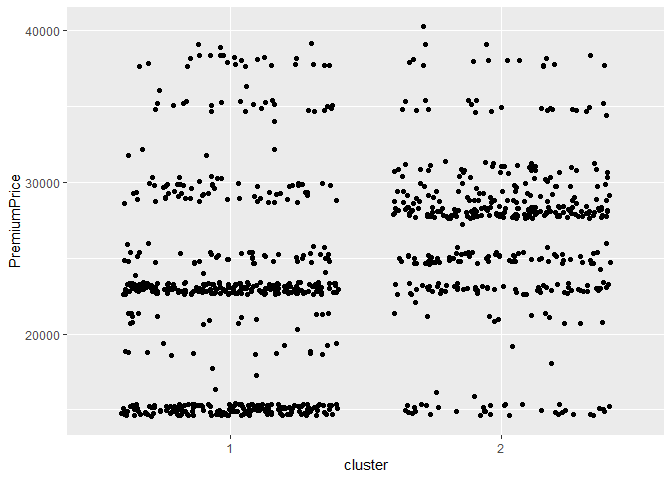<!-- -->

``` r
X.a = dt[, -dim(df)[2]]
y.a = df[, dim(df)[2]]
X.a = X.a[, -dim(X.a)[2]]
```

## FAMD with BMI, BMI_cat

``` r
res.famd.a = FAMD(X.a)
```

    ## Warning: ggrepel: 926 unlabeled data points (too many overlaps). Consider
    ## increasing max.overlaps

    ## Warning: ggrepel: 10 unlabeled data points (too many overlaps). Consider
    ## increasing max.overlaps

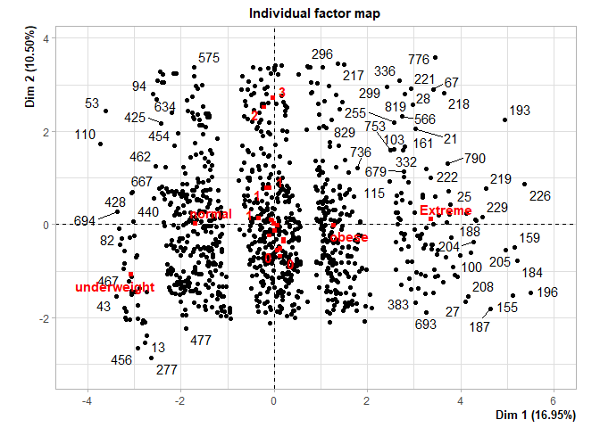<!-- -->

    ## Warning: ggrepel: 926 unlabeled data points (too many overlaps). Consider
    ## increasing max.overlaps

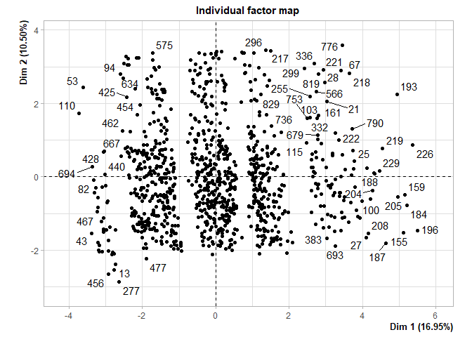<!-- -->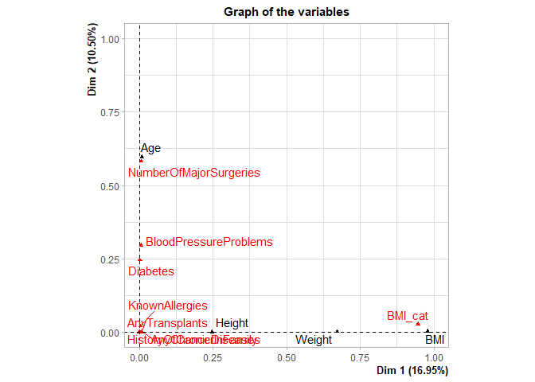<!-- -->

    ## Warning: ggrepel: 4 unlabeled data points (too many overlaps). Consider
    ## increasing max.overlaps

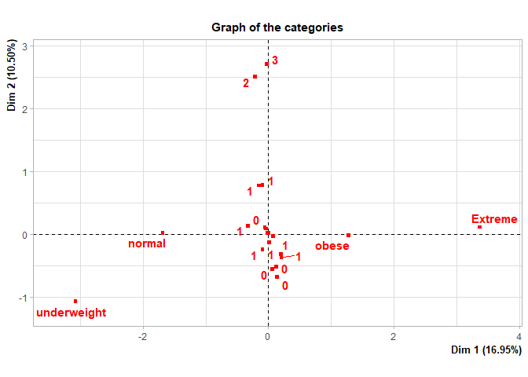<!-- -->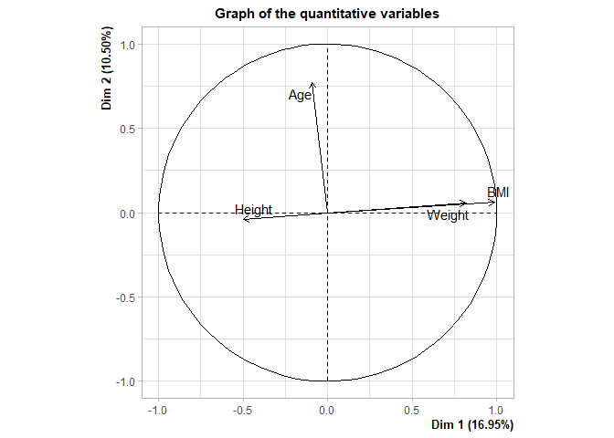<!-- -->

``` r
fviz_mfa_ind(res.famd.a, habillage="BMI_cat", palette=c("red", "blue", "green", "yellow", "purple"), addEllipses=T, repel=T, geom="point")
```

<!-- -->

``` r
res.km.a = kmeans(res.famd.a$ind$coord, centers=4, nstart=25, iter.max=30)
fviz_mfa_ind(res.famd.a, habillage=as.factor(res.km.a$cluster), palette=c("red", "blue", "green", "yellow", "purple", "black"), addEllipses=F, repel=T, geom="point")
```

<!-- -->

``` r
dt["cluster"] = res.km.a$cluster
ggplot(dt, aes(x=cluster, y=PremiumPrice)) +
  geom_jitter()
```

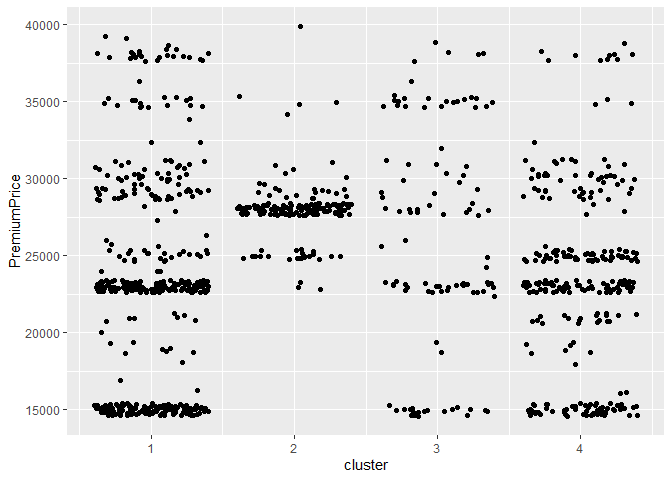<!-- -->

``` r
ggplot(dt, aes(x=cluster, y=Age)) +
  geom_jitter()
```

<!-- -->

``` r
ggplot(dt, aes(x=cluster, y=BMI)) +
  geom_jitter()
```

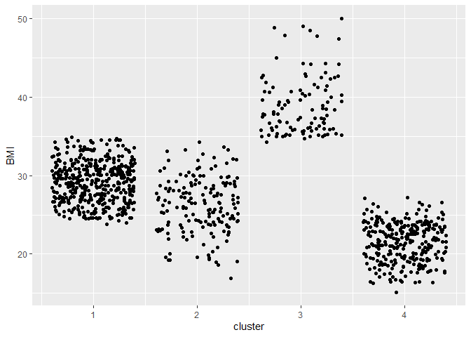<!-- -->
