R Notebook
================

``` r
library(ggplot2)
library(RColorBrewer)
library(dplyr)
library(GGally)
library(readr)
library(ggjoy)
library(FactoMineR)
library(factoextra)
library(ggpubr)
library(corrplot)
library(cowplot)
```

``` r
Medicalpremium <- read_csv("C:/Users/malis/3rdYear/New folder (3)/New folder/Medicalpremium.csv")
```

    ## Rows: 986 Columns: 11
    ## ── Column specification ────────────────────────────────────────────────────────
    ## Delimiter: ","
    ## dbl (11): Age, Diabetes, BloodPressureProblems, AnyTransplants, AnyChronicDi...
    ## 
    ## ℹ Use `spec()` to retrieve the full column specification for this data.
    ## ℹ Specify the column types or set `show_col_types = FALSE` to quiet this message.

``` r
df = Medicalpremium
df
```

    ## # A tibble: 986 × 11
    ##      Age Diabetes BloodPressureProblems AnyTransplants AnyChronicDiseases Height
    ##    <dbl>    <dbl>                 <dbl>          <dbl>              <dbl>  <dbl>
    ##  1    45        0                     0              0                  0    155
    ##  2    60        1                     0              0                  0    180
    ##  3    36        1                     1              0                  0    158
    ##  4    52        1                     1              0                  1    183
    ##  5    38        0                     0              0                  1    166
    ##  6    30        0                     0              0                  0    160
    ##  7    33        0                     0              0                  0    150
    ##  8    23        0                     0              0                  0    181
    ##  9    48        1                     0              0                  0    169
    ## 10    38        0                     0              0                  0    182
    ## # ℹ 976 more rows
    ## # ℹ 5 more variables: Weight <dbl>, KnownAllergies <dbl>,
    ## #   HistoryOfCancerInFamily <dbl>, NumberOfMajorSurgeries <dbl>,
    ## #   PremiumPrice <dbl>

## preprocessing

``` r
cat.cols = colnames(df[, -c(which(colnames(df) %in% c("Age", "Weight", "Height", "PremiumPrice")))])
num.cols = colnames(df[, c(which(colnames(df) %in% c("Age", "Weight", "Height", "PremiumPrice")))])

cat.cols
```

    ## [1] "Diabetes"                "BloodPressureProblems"  
    ## [3] "AnyTransplants"          "AnyChronicDiseases"     
    ## [5] "KnownAllergies"          "HistoryOfCancerInFamily"
    ## [7] "NumberOfMajorSurgeries"

``` r
num.cols
```

    ## [1] "Age"          "Height"       "Weight"       "PremiumPrice"

``` r
df[, cat.cols] = lapply(df[, cat.cols], factor)
lapply(df, class)
```

    ## $Age
    ## [1] "numeric"
    ## 
    ## $Diabetes
    ## [1] "factor"
    ## 
    ## $BloodPressureProblems
    ## [1] "factor"
    ## 
    ## $AnyTransplants
    ## [1] "factor"
    ## 
    ## $AnyChronicDiseases
    ## [1] "factor"
    ## 
    ## $Height
    ## [1] "numeric"
    ## 
    ## $Weight
    ## [1] "numeric"
    ## 
    ## $KnownAllergies
    ## [1] "factor"
    ## 
    ## $HistoryOfCancerInFamily
    ## [1] "factor"
    ## 
    ## $NumberOfMajorSurgeries
    ## [1] "factor"
    ## 
    ## $PremiumPrice
    ## [1] "numeric"

``` r
dt = df
```

## feature engineering

``` r
dt = dt %>%
  mutate(BMI = df$Weight/((df$Height/100)^2)) %>%
  mutate(BMI_cat = cut(BMI, breaks=c(-Inf, 18.5, 24.5, 29.9, 34.9, Inf), 
                       labels=c("underweight", "normal", "overweight", "obese", "Extreme")))
dt
```

    ## # A tibble: 986 × 13
    ##      Age Diabetes BloodPressureProblems AnyTransplants AnyChronicDiseases Height
    ##    <dbl> <fct>    <fct>                 <fct>          <fct>               <dbl>
    ##  1    45 0        0                     0              0                     155
    ##  2    60 1        0                     0              0                     180
    ##  3    36 1        1                     0              0                     158
    ##  4    52 1        1                     0              1                     183
    ##  5    38 0        0                     0              1                     166
    ##  6    30 0        0                     0              0                     160
    ##  7    33 0        0                     0              0                     150
    ##  8    23 0        0                     0              0                     181
    ##  9    48 1        0                     0              0                     169
    ## 10    38 0        0                     0              0                     182
    ## # ℹ 976 more rows
    ## # ℹ 7 more variables: Weight <dbl>, KnownAllergies <fct>,
    ## #   HistoryOfCancerInFamily <fct>, NumberOfMajorSurgeries <fct>,
    ## #   PremiumPrice <dbl>, BMI <dbl>, BMI_cat <fct>

``` r
cat.cols = colnames(dt)[lapply(dt, class) == "factor"]
num.cols = colnames(dt)[lapply(dt, class) == "numeric"]
```

## EDA

``` r
attach(dt)
```

``` r
ggplot(dt, mapping=aes(x=Age,
                       y=NumberOfMajorSurgeries, 
                       fill=NumberOfMajorSurgeries)) +
  geom_boxplot() +
  scale_fill_brewer(palette = "Paired")
```

<!-- -->

``` r
dt %>%
  group_by(NumberOfMajorSurgeries) %>%
  count()
```

    ## # A tibble: 4 × 2
    ## # Groups:   NumberOfMajorSurgeries [4]
    ##   NumberOfMajorSurgeries     n
    ##   <fct>                  <int>
    ## 1 0                        479
    ## 2 1                        372
    ## 3 2                        119
    ## 4 3                         16

``` r
ggplot() +
  geom_joy(dt, mapping=aes(x=Age, 
                        y=NumberOfMajorSurgeries,
                        fill=BloodPressureProblems), scale=1, alpha=0.7, rel_min_height=0.02) +
  scale_fill_brewer(palette = "Set1")
```

    ## Picking joint bandwidth of 2.63

<!-- -->

``` r
ggplot(dt, mapping=aes(x=Age, color=BloodPressureProblems)) +
  geom_histogram(binwidth=1, fill="black") +
  facet_wrap(~NumberOfMajorSurgeries, nrow = 3) +
  scale_color_brewer(palette="Set1")
```

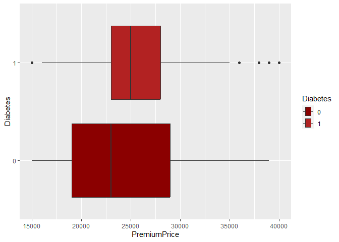<!-- -->

``` r
histBox = function(var, ...) {
  plt1 = ggplot(dt, aes(x=!!sym(var))) +
    geom_histogram(..., color="lightblue", fill="darkblue", alpha=0.7) +
    xlab("")
  
  plt2 = ggplot(dt, aes(x=!!sym(var))) +
    geom_boxplot(fill="lightblue", color="darkblue", alpha=0.7)
  
  cowplot::plot_grid(plt1, plt2, ncol=1, rel_heights=c(2, 1), align='v', axis='lr')
  }
```

``` r
histBox("Age", binwidth=1)
```

<!-- -->

``` r
histBox("PremiumPrice", binwidth=2500)
```

<!-- -->

``` r
for (i in cat.cols) {
  plt = ggplot(dt, aes(x=!!sym(i), fill=!!sym(i))) +
    geom_bar() +
    scale_fill_brewer(palette="Set2")
  print(plt)
}
```

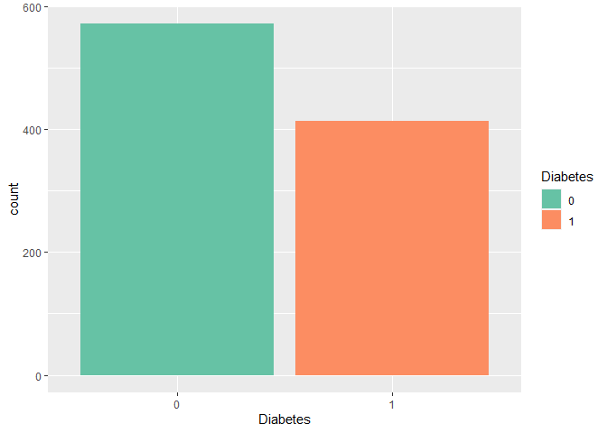<!-- --><!-- --><!-- -->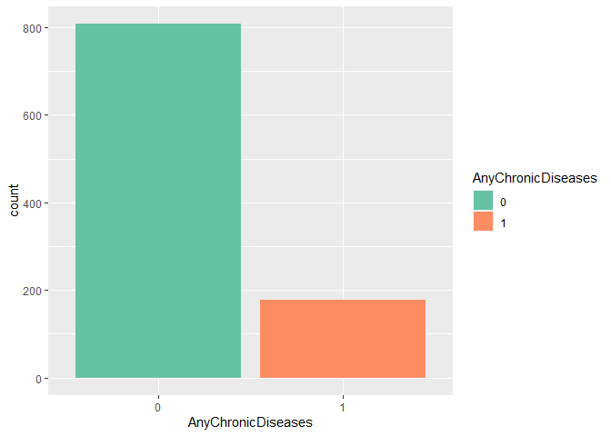<!-- -->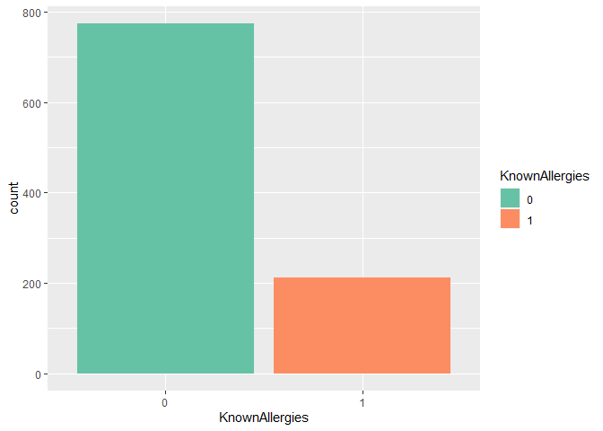<!-- -->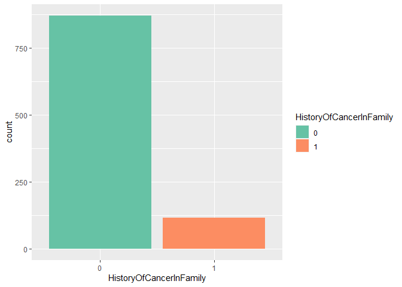<!-- -->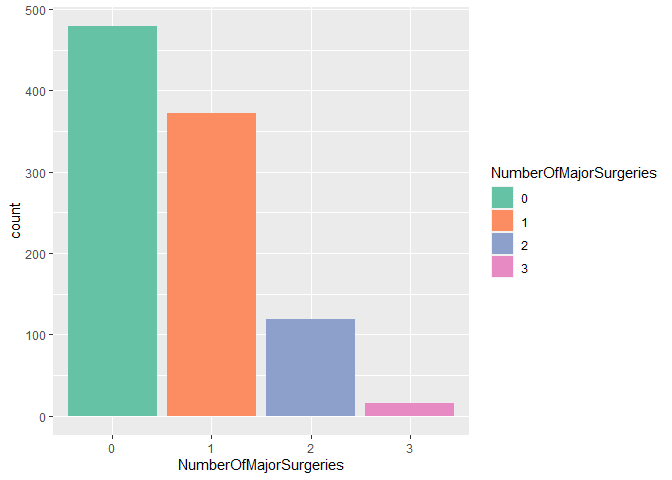<!-- -->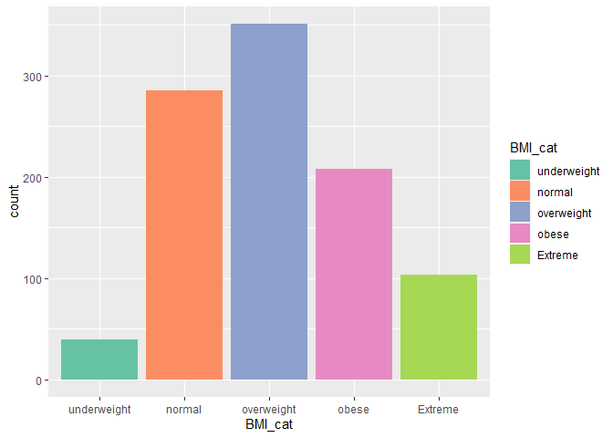<!-- -->

``` r
for (i in num.cols) {
  plt = ggplot(dt, aes(y=!!sym(i))) +
    geom_boxplot(fill="coral", color="black") +
    scale_fill_brewer(palette="Set2")
  print(plt)
}
```

<!-- -->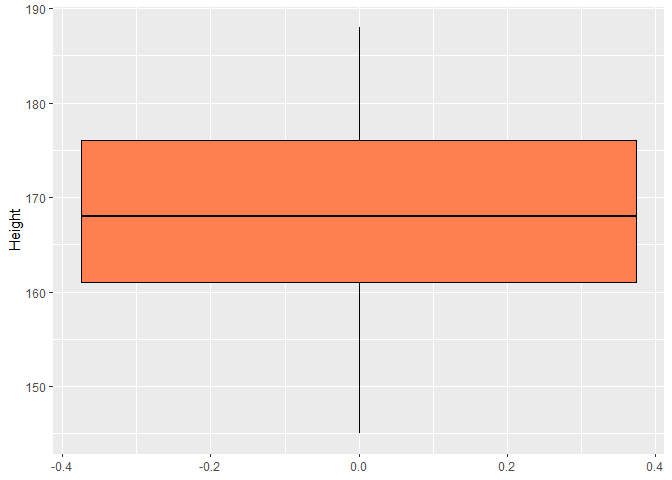<!-- -->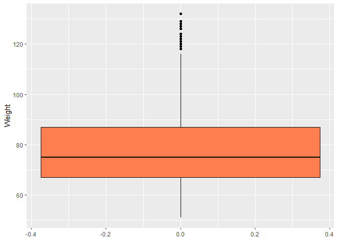<!-- -->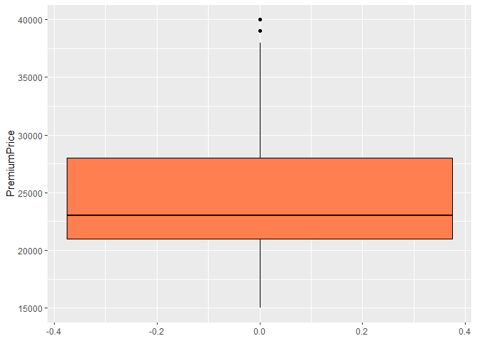<!-- -->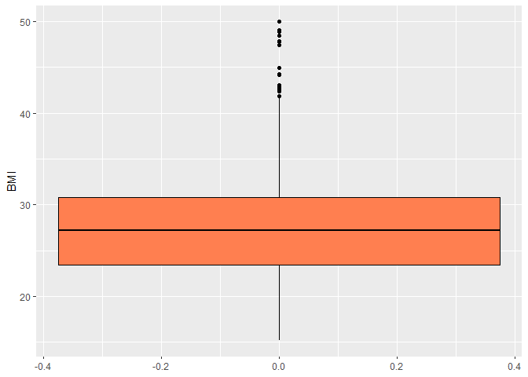<!-- -->

``` r
ggpairs(dt[, num.cols])
```

<!-- -->

## FAMD

## FAMD with original data

``` r
X = df[, -dim(df)[2]]
y = df[, dim(df)[2]]
```

``` r
X
```

    ## # A tibble: 986 × 10
    ##      Age Diabetes BloodPressureProblems AnyTransplants AnyChronicDiseases Height
    ##    <dbl> <fct>    <fct>                 <fct>          <fct>               <dbl>
    ##  1    45 0        0                     0              0                     155
    ##  2    60 1        0                     0              0                     180
    ##  3    36 1        1                     0              0                     158
    ##  4    52 1        1                     0              1                     183
    ##  5    38 0        0                     0              1                     166
    ##  6    30 0        0                     0              0                     160
    ##  7    33 0        0                     0              0                     150
    ##  8    23 0        0                     0              0                     181
    ##  9    48 1        0                     0              0                     169
    ## 10    38 0        0                     0              0                     182
    ## # ℹ 976 more rows
    ## # ℹ 4 more variables: Weight <dbl>, KnownAllergies <fct>,
    ## #   HistoryOfCancerInFamily <fct>, NumberOfMajorSurgeries <fct>

``` r
res.famd = FAMD(X)
```

    ## Warning: ggrepel: 947 unlabeled data points (too many overlaps). Consider
    ## increasing max.overlaps

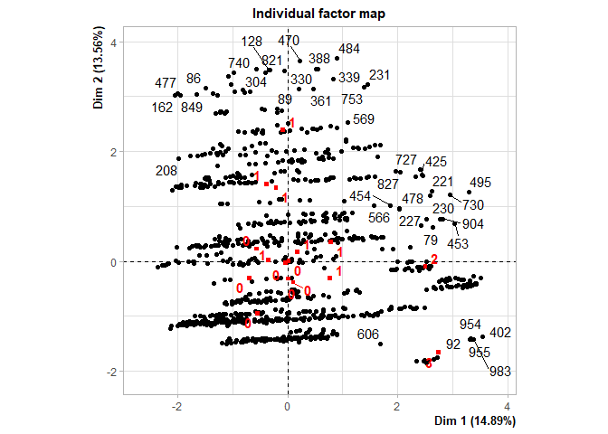<!-- -->

    ## Warning: ggrepel: 947 unlabeled data points (too many overlaps). Consider
    ## increasing max.overlaps

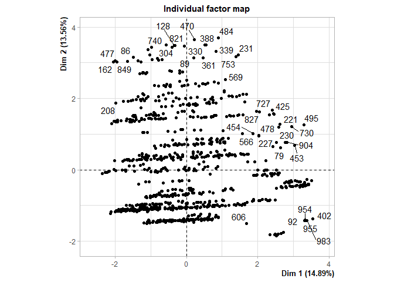<!-- -->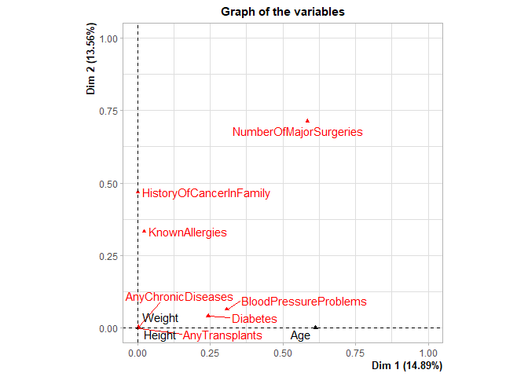<!-- -->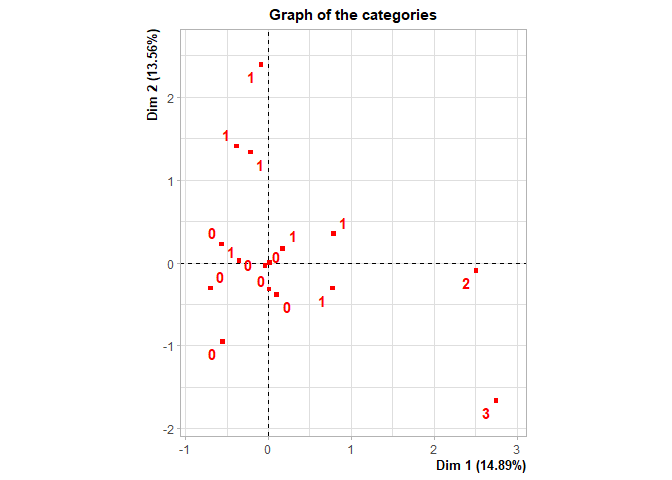<!-- -->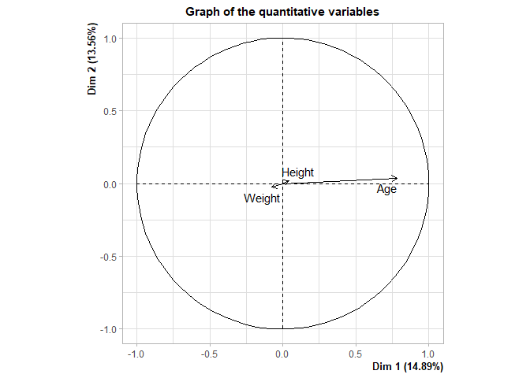<!-- -->

``` r
res.famd$eig
```

    ##        eigenvalue percentage of variance cumulative percentage of variance
    ## comp 1   1.787189              14.893244                          14.89324
    ## comp 2   1.627318              13.560983                          28.45423
    ## comp 3   1.156018               9.633485                          38.08771
    ## comp 4   1.096156               9.134633                          47.22234
    ## comp 5   1.024013               8.533443                          55.75579

``` r
fviz_mfa_ind(res.famd, geom="point", habillage = "BloodPressureProblems")
```

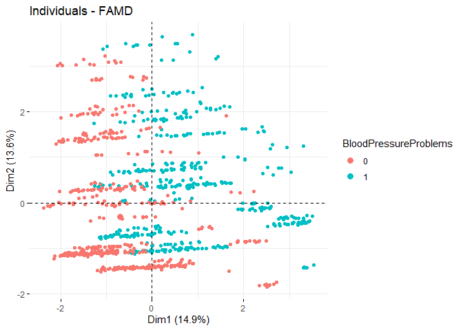<!-- -->

``` r
fviz_mfa_ind(res.famd, habillage="Diabetes", palette="Accent", addEllipses=F, repel=T, geom="point")
```

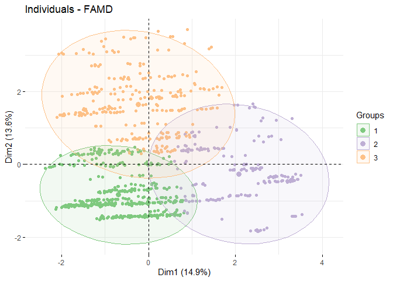<!-- -->

``` r
res.km = kmeans(res.famd$ind$coord, centers=3, nstart=25, iter.max=50)
fviz_mfa_ind(res.famd, habillage=as.factor(res.km$cluster), palette="Accent", addEllipses=F, repel=T, geom="point")
```

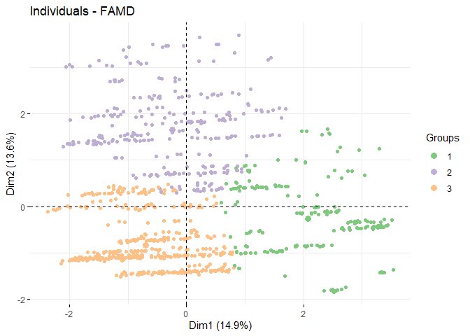<!-- -->

``` r
dt["cluster"] = res.km$cluster
dt
```

    ## # A tibble: 986 × 14
    ##      Age Diabetes BloodPressureProblems AnyTransplants AnyChronicDiseases Height
    ##    <dbl> <fct>    <fct>                 <fct>          <fct>               <dbl>
    ##  1    45 0        0                     0              0                     155
    ##  2    60 1        0                     0              0                     180
    ##  3    36 1        1                     0              0                     158
    ##  4    52 1        1                     0              1                     183
    ##  5    38 0        0                     0              1                     166
    ##  6    30 0        0                     0              0                     160
    ##  7    33 0        0                     0              0                     150
    ##  8    23 0        0                     0              0                     181
    ##  9    48 1        0                     0              0                     169
    ## 10    38 0        0                     0              0                     182
    ## # ℹ 976 more rows
    ## # ℹ 8 more variables: Weight <dbl>, KnownAllergies <fct>,
    ## #   HistoryOfCancerInFamily <fct>, NumberOfMajorSurgeries <fct>,
    ## #   PremiumPrice <dbl>, BMI <dbl>, BMI_cat <fct>, cluster <int>

``` r
fviz_nbclust(X, kmeans, method = "wss")
```

<!-- -->

``` r
ggplot(dt, aes(x=as.factor(cluster), y=PremiumPrice, color=as.factor(cluster))) +
  geom_jitter(alpha=0.4)
```

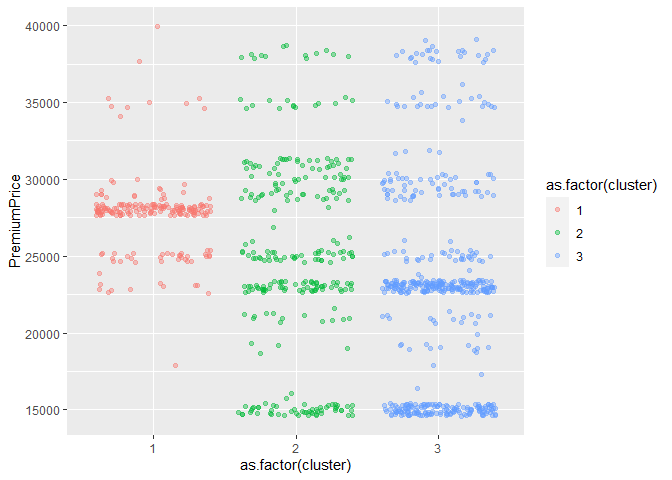<!-- -->

``` r
ggplot(dt, aes(x=Age, y=PremiumPrice)) +
  geom_point(color=dt$cluster)
```

<!-- -->

``` r
temp = dt[, c(cat.cols, "cluster")]
summary(temp[temp$cluster == 1, ])
```

    ##  Diabetes BloodPressureProblems AnyTransplants AnyChronicDiseases
    ##  0: 53    0: 41                 0:193          0:158             
    ##  1:147    1:159                 1:  7          1: 42             
    ##                                                                  
    ##                                                                  
    ##                                                                  
    ##                                                                  
    ##  KnownAllergies HistoryOfCancerInFamily NumberOfMajorSurgeries        BMI_cat  
    ##  0:184          0:190                   0: 32                  underweight: 4  
    ##  1: 16          1: 10                   1: 35                  normal     :70  
    ##                                         2:117                  overweight :75  
    ##                                         3: 16                  obese      :34  
    ##                                                                Extreme    :17  
    ##                                                                                
    ##     cluster 
    ##  Min.   :1  
    ##  1st Qu.:1  
    ##  Median :1  
    ##  Mean   :1  
    ##  3rd Qu.:1  
    ##  Max.   :1

``` r
summary(temp[temp$cluster == 2, ])
```

    ##  Diabetes BloodPressureProblems AnyTransplants AnyChronicDiseases
    ##  0:203    0:113                 0:269          0:234             
    ##  1: 82    1:172                 1: 16          1: 51             
    ##                                                                  
    ##                                                                  
    ##                                                                  
    ##                                                                  
    ##  KnownAllergies HistoryOfCancerInFamily NumberOfMajorSurgeries        BMI_cat  
    ##  0:132          0:179                   0:  7                  underweight:10  
    ##  1:153          1:106                   1:276                  normal     :89  
    ##                                         2:  2                  overweight :94  
    ##                                         3:  0                  obese      :61  
    ##                                                                Extreme    :31  
    ##                                                                                
    ##     cluster 
    ##  Min.   :2  
    ##  1st Qu.:2  
    ##  Median :2  
    ##  Mean   :2  
    ##  3rd Qu.:2  
    ##  Max.   :2

``` r
summary(temp[temp$cluster == 3, ])
```

    ##  Diabetes BloodPressureProblems AnyTransplants AnyChronicDiseases
    ##  0:316    0:370                 0:469          0:416             
    ##  1:185    1:131                 1: 32          1: 85             
    ##                                                                  
    ##                                                                  
    ##                                                                  
    ##                                                                  
    ##  KnownAllergies HistoryOfCancerInFamily NumberOfMajorSurgeries
    ##  0:458          0:501                   0:440                 
    ##  1: 43          1:  0                   1: 61                 
    ##                                         2:  0                 
    ##                                         3:  0                 
    ##                                                               
    ##                                                               
    ##         BMI_cat       cluster 
    ##  underweight: 25   Min.   :3  
    ##  normal     :126   1st Qu.:3  
    ##  overweight :182   Median :3  
    ##  obese      :113   Mean   :3  
    ##  Extreme    : 55   3rd Qu.:3  
    ##                    Max.   :3

``` r
dt$cluster = factor(dt$cluster)
lapply(dt, class)
```

    ## $Age
    ## [1] "numeric"
    ## 
    ## $Diabetes
    ## [1] "factor"
    ## 
    ## $BloodPressureProblems
    ## [1] "factor"
    ## 
    ## $AnyTransplants
    ## [1] "factor"
    ## 
    ## $AnyChronicDiseases
    ## [1] "factor"
    ## 
    ## $Height
    ## [1] "numeric"
    ## 
    ## $Weight
    ## [1] "numeric"
    ## 
    ## $KnownAllergies
    ## [1] "factor"
    ## 
    ## $HistoryOfCancerInFamily
    ## [1] "factor"
    ## 
    ## $NumberOfMajorSurgeries
    ## [1] "factor"
    ## 
    ## $PremiumPrice
    ## [1] "numeric"
    ## 
    ## $BMI
    ## [1] "numeric"
    ## 
    ## $BMI_cat
    ## [1] "factor"
    ## 
    ## $cluster
    ## [1] "factor"

## hierachical clustering with original data

``` r
res.hcpc = HCPC(res.famd, graph=F, nb.clust=2)
```

``` r
fviz_cluster(res.hcpc, geom="point")
```

<!-- -->

``` r
clust = res.hcpc$data.clust
dt["cluster"] = clust$clust
dt
```

    ## # A tibble: 986 × 14
    ##      Age Diabetes BloodPressureProblems AnyTransplants AnyChronicDiseases Height
    ##    <dbl> <fct>    <fct>                 <fct>          <fct>               <dbl>
    ##  1    45 0        0                     0              0                     155
    ##  2    60 1        0                     0              0                     180
    ##  3    36 1        1                     0              0                     158
    ##  4    52 1        1                     0              1                     183
    ##  5    38 0        0                     0              1                     166
    ##  6    30 0        0                     0              0                     160
    ##  7    33 0        0                     0              0                     150
    ##  8    23 0        0                     0              0                     181
    ##  9    48 1        0                     0              0                     169
    ## 10    38 0        0                     0              0                     182
    ## # ℹ 976 more rows
    ## # ℹ 8 more variables: Weight <dbl>, KnownAllergies <fct>,
    ## #   HistoryOfCancerInFamily <fct>, NumberOfMajorSurgeries <fct>,
    ## #   PremiumPrice <dbl>, BMI <dbl>, BMI_cat <fct>, cluster <fct>

``` r
ggplot(dt, aes(x=cluster, y=PremiumPrice)) +
  geom_jitter()
```

<!-- -->

``` r
X.a = dt[, -dim(df)[2]]
y.a = df[, dim(df)[2]]
X.a = X.a[, -dim(X.a)[2]]
```

## FAMD with BMI, BMI_cat

``` r
res.famd.a = FAMD(X.a)
```

    ## Warning: ggrepel: 926 unlabeled data points (too many overlaps). Consider
    ## increasing max.overlaps

    ## Warning: ggrepel: 10 unlabeled data points (too many overlaps). Consider
    ## increasing max.overlaps

<!-- -->

    ## Warning: ggrepel: 926 unlabeled data points (too many overlaps). Consider
    ## increasing max.overlaps

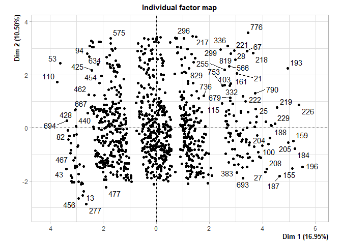<!-- -->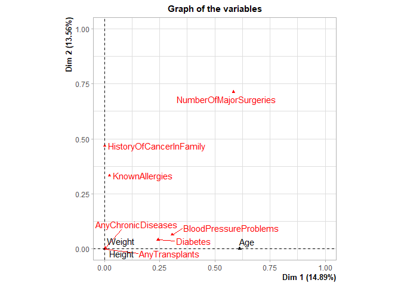<!-- -->

    ## Warning: ggrepel: 4 unlabeled data points (too many overlaps). Consider
    ## increasing max.overlaps

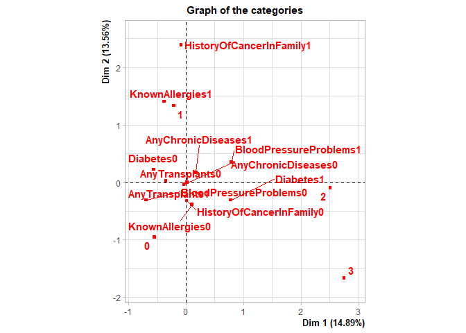<!-- -->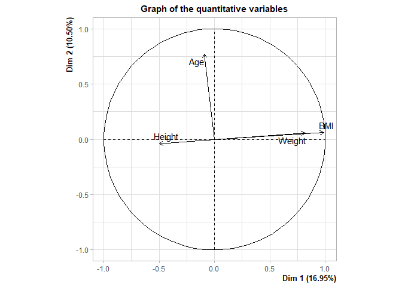<!-- -->

``` r
fviz_mfa_ind(res.famd.a, habillage="BMI_cat", palette=c("red", "blue", "green", "yellow", "purple"), addEllipses=T, repel=T, geom="point")
```

<!-- -->

``` r
res.km.a = kmeans(res.famd.a$ind$coord, centers=4, nstart=25, iter.max=30)
fviz_mfa_ind(res.famd.a, habillage=as.factor(res.km.a$cluster), palette=c("red", "blue", "green", "yellow", "purple", "black"), addEllipses=F, repel=T, geom="point")
```

<!-- -->

``` r
dt["cluster"] = res.km.a$cluster
ggplot(dt, aes(x=cluster, y=PremiumPrice)) +
  geom_jitter()
```

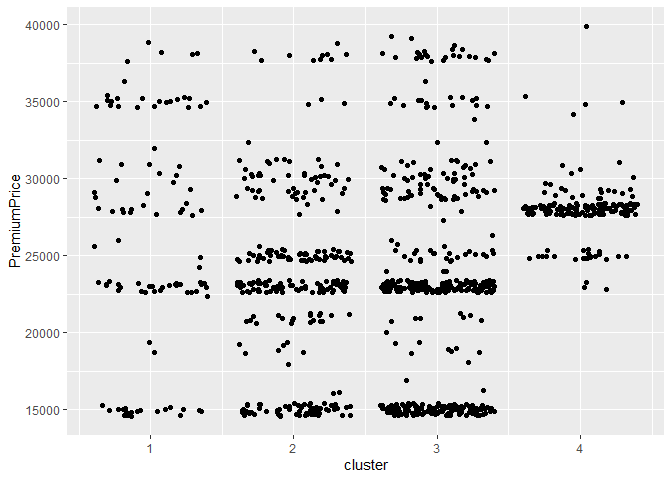<!-- -->
