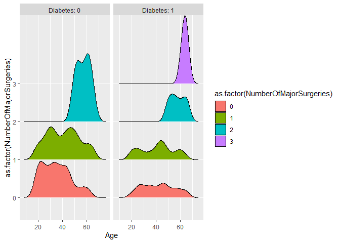

R
================

``` r
library(ggplot2)
library(dplyr)
```

    ## 
    ## Attaching package: 'dplyr'

    ## The following objects are masked from 'package:stats':
    ## 
    ##     filter, lag

    ## The following objects are masked from 'package:base':
    ## 
    ##     intersect, setdiff, setequal, union

``` r
library(GGally)
```

    ## Warning: package 'GGally' was built under R version 4.3.2

    ## Registered S3 method overwritten by 'GGally':
    ##   method from   
    ##   +.gg   ggplot2

``` r
library(readr)
library(ggjoy)
```

    ## Warning: package 'ggjoy' was built under R version 4.3.2

    ## Loading required package: ggridges

    ## Warning: package 'ggridges' was built under R version 4.3.2

    ## The ggjoy package has been deprecated. Please switch over to the
    ## ggridges package, which provides the same functionality. Porting
    ## guidelines can be found here:
    ## https://github.com/clauswilke/ggjoy/blob/master/README.md

``` r
Medicalpremium <- read_csv("C:/Users/malis/3rdYear/New folder (3)/New folder/Medicalpremium.csv")
```

    ## Rows: 986 Columns: 11

    ## ── Column specification ────────────────────────────────────────────────────────
    ## Delimiter: ","
    ## dbl (11): Age, Diabetes, BloodPressureProblems, AnyTransplants, AnyChronicDi...
    ## 
    ## ℹ Use `spec()` to retrieve the full column specification for this data.
    ## ℹ Specify the column types or set `show_col_types = FALSE` to quiet this message.

``` r
df = Medicalpremium

lapply(df, class)
```

    ## $Age
    ## [1] "numeric"
    ## 
    ## $Diabetes
    ## [1] "numeric"
    ## 
    ## $BloodPressureProblems
    ## [1] "numeric"
    ## 
    ## $AnyTransplants
    ## [1] "numeric"
    ## 
    ## $AnyChronicDiseases
    ## [1] "numeric"
    ## 
    ## $Height
    ## [1] "numeric"
    ## 
    ## $Weight
    ## [1] "numeric"
    ## 
    ## $KnownAllergies
    ## [1] "numeric"
    ## 
    ## $HistoryOfCancerInFamily
    ## [1] "numeric"
    ## 
    ## $NumberOfMajorSurgeries
    ## [1] "numeric"
    ## 
    ## $PremiumPrice
    ## [1] "numeric"

``` r
unique(df$NumberOfMajorSurgeries)
```

    ## [1] 0 1 2 3

``` r
ggplot(df, mapping=aes(x=Age, 
                       y=as.factor(NumberOfMajorSurgeries),
                       fill=as.factor(NumberOfMajorSurgeries))) +
  geom_boxplot() +
  geom_jitter(alpha=0.2, size=0.5)
```

<!-- -->

``` r
ggplot(df, aes(x=df$Age, y=as.factor(df$Diabetes), fill=as.factor(df$Diabetes))) +
  geom_boxplot()
```

<!-- -->

``` r
ggplot() +
  geom_point(df, mapping=aes(x=df$Weight, y=df$Height, color=as.factor(df$BloodPressureProblems)))
```

<!-- -->

``` r
ggcorr(df[c("Age", "Weight", "Height", "PremiumPrice")])
```

<!-- -->

``` r
ggplot() +
  geom_joy(df, mapping=aes(x=Age, y=as.factor(df$NumberOfMajorSurgeries), 
                           fill=as.factor(df$NumberOfMajorSurgeries)))
```

    ## Picking joint bandwidth of 2.39

<!-- -->

``` r
ggplot() +
  geom_joy(df, mapping=aes(x=Age, y=as.factor(NumberOfMajorSurgeries), 
                           fill=as.factor(NumberOfMajorSurgeries))) + 
  facet_grid(~Diabetes, 
             labeller=labeller(.rows=label_both, .cols=label_both))
```

    ## Picking joint bandwidth of 3.22

    ## Picking joint bandwidth of 2.88

<!-- -->

``` r
ggplot() +
  geom_joy(df, mapping=aes(x=Age, y=as.factor(NumberOfMajorSurgeries), 
                           fill=as.factor(NumberOfMajorSurgeries))) + 
  facet_grid(~BloodPressureProblems, 
             labeller=labeller(.rows=label_both, .cols=label_both))
```

    ## Picking joint bandwidth of 2.58

    ## Picking joint bandwidth of 2.69

<!-- -->

``` r
df= df %>%
  mutate(BMI = df$Weight/((df$Height/100)^2)) %>%
  mutate(BMI_cat = cut(BMI, breaks=c(-Inf, 18.5, 24.5, 29.9, 34.9, Inf), 
                       labels=c("underweight", "normal", "overweight", "obese", "Extreme")))
```

``` r
df
```

    ## # A tibble: 986 × 13
    ##      Age Diabetes BloodPressureProblems AnyTransplants AnyChronicDiseases Height
    ##    <dbl>    <dbl>                 <dbl>          <dbl>              <dbl>  <dbl>
    ##  1    45        0                     0              0                  0    155
    ##  2    60        1                     0              0                  0    180
    ##  3    36        1                     1              0                  0    158
    ##  4    52        1                     1              0                  1    183
    ##  5    38        0                     0              0                  1    166
    ##  6    30        0                     0              0                  0    160
    ##  7    33        0                     0              0                  0    150
    ##  8    23        0                     0              0                  0    181
    ##  9    48        1                     0              0                  0    169
    ## 10    38        0                     0              0                  0    182
    ## # ℹ 976 more rows
    ## # ℹ 7 more variables: Weight <dbl>, KnownAllergies <dbl>,
    ## #   HistoryOfCancerInFamily <dbl>, NumberOfMajorSurgeries <dbl>,
    ## #   PremiumPrice <dbl>, BMI <dbl>, BMI_cat <fct>

``` r
ggplot() +
  geom_joy(df, mapping=aes(x=Age, y=BMI_cat, 
                           fill=BMI_cat)) +
  facet_grid(~Diabetes, 
             labeller=labeller(.rows=label_both, .cols=label_both))
```

    ## Picking joint bandwidth of 4.79

    ## Picking joint bandwidth of 5.71

<!-- -->
