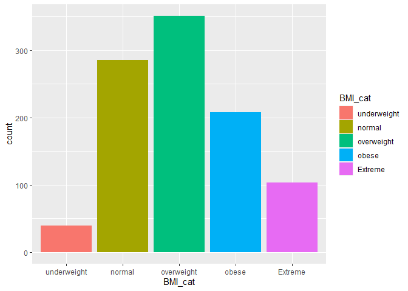
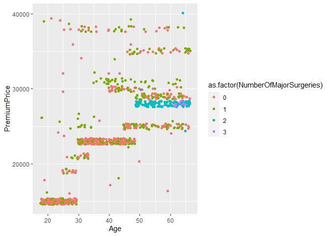
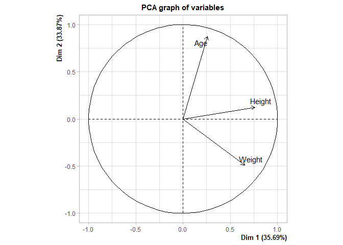

R
================

``` r
library(ggplot2)
library(dplyr)
```

    ## 
    ## Attaching package: 'dplyr'

    ## The following objects are masked from 'package:stats':
    ## 
    ##     filter, lag

    ## The following objects are masked from 'package:base':
    ## 
    ##     intersect, setdiff, setequal, union

``` r
library(GGally)
```

    ## Warning: package 'GGally' was built under R version 4.3.2

    ## Registered S3 method overwritten by 'GGally':
    ##   method from   
    ##   +.gg   ggplot2

``` r
library(readr)
library(ggjoy)
```

    ## Warning: package 'ggjoy' was built under R version 4.3.2

    ## Loading required package: ggridges

    ## Warning: package 'ggridges' was built under R version 4.3.2

    ## The ggjoy package has been deprecated. Please switch over to the
    ## ggridges package, which provides the same functionality. Porting
    ## guidelines can be found here:
    ## https://github.com/clauswilke/ggjoy/blob/master/README.md

``` r
Medicalpremium <- read_csv("C:/Users/malis/3rdYear/New folder (3)/New folder/Medicalpremium.csv")
```

    ## Rows: 986 Columns: 11

    ## ── Column specification ────────────────────────────────────────────────────────
    ## Delimiter: ","
    ## dbl (11): Age, Diabetes, BloodPressureProblems, AnyTransplants, AnyChronicDi...
    ## 
    ## ℹ Use `spec()` to retrieve the full column specification for this data.
    ## ℹ Specify the column types or set `show_col_types = FALSE` to quiet this message.

``` r
df = Medicalpremium

lapply(df, class)
```

    ## $Age
    ## [1] "numeric"
    ## 
    ## $Diabetes
    ## [1] "numeric"
    ## 
    ## $BloodPressureProblems
    ## [1] "numeric"
    ## 
    ## $AnyTransplants
    ## [1] "numeric"
    ## 
    ## $AnyChronicDiseases
    ## [1] "numeric"
    ## 
    ## $Height
    ## [1] "numeric"
    ## 
    ## $Weight
    ## [1] "numeric"
    ## 
    ## $KnownAllergies
    ## [1] "numeric"
    ## 
    ## $HistoryOfCancerInFamily
    ## [1] "numeric"
    ## 
    ## $NumberOfMajorSurgeries
    ## [1] "numeric"
    ## 
    ## $PremiumPrice
    ## [1] "numeric"

``` r
unique(df$NumberOfMajorSurgeries)
```

    ## [1] 0 1 2 3

``` r
ggplot(df, mapping=aes(x=Age, 
                       y=as.factor(NumberOfMajorSurgeries),
                       fill=as.factor(NumberOfMajorSurgeries))) +
  geom_boxplot() +
  geom_jitter(alpha=0.2, size=0.5)
```

<!-- -->

``` r
ggplot(df, aes(x=df$Age, y=as.factor(df$Diabetes), fill=as.factor(df$Diabetes))) +
  geom_boxplot()
```

<!-- -->

``` r
ggplot() +
  geom_point(df, mapping=aes(x=df$Weight, y=df$Height, color=as.factor(df$BloodPressureProblems)))
```

<!-- -->

``` r
ggcorr(df[c("Age", "Weight", "Height", "PremiumPrice")])
```

<!-- -->

``` r
ggplot() +
  geom_joy(df, mapping=aes(x=Age, y=as.factor(df$NumberOfMajorSurgeries), 
                           fill=as.factor(df$NumberOfMajorSurgeries)))
```

    ## Picking joint bandwidth of 2.39

<!-- -->

``` r
ggplot() +
  geom_joy(df, mapping=aes(x=Age, y=as.factor(NumberOfMajorSurgeries), 
                           fill=as.factor(NumberOfMajorSurgeries))) + 
  facet_grid(~Diabetes, 
             labeller=labeller(.rows=label_both, .cols=label_both))
```

    ## Picking joint bandwidth of 3.22

    ## Picking joint bandwidth of 2.88

<!-- -->

``` r
ggplot() +
  geom_joy(df, mapping=aes(x=Age, y=as.factor(NumberOfMajorSurgeries), 
                           fill=as.factor(NumberOfMajorSurgeries))) + 
  facet_grid(~BloodPressureProblems, 
             labeller=labeller(.rows=label_both, .cols=label_both))
```

    ## Picking joint bandwidth of 2.58

    ## Picking joint bandwidth of 2.69

<!-- -->

``` r
df= df %>%
  mutate(BMI = df$Weight/((df$Height/100)^2)) %>%
  mutate(BMI_cat = cut(BMI, breaks=c(-Inf, 18.5, 24.5, 29.9, 34.9, Inf), 
                       labels=c("underweight", "normal", "overweight", "obese", "Extreme")))
```

``` r
df
```

    ## # A tibble: 986 × 13
    ##      Age Diabetes BloodPressureProblems AnyTransplants AnyChronicDiseases Height
    ##    <dbl>    <dbl>                 <dbl>          <dbl>              <dbl>  <dbl>
    ##  1    45        0                     0              0                  0    155
    ##  2    60        1                     0              0                  0    180
    ##  3    36        1                     1              0                  0    158
    ##  4    52        1                     1              0                  1    183
    ##  5    38        0                     0              0                  1    166
    ##  6    30        0                     0              0                  0    160
    ##  7    33        0                     0              0                  0    150
    ##  8    23        0                     0              0                  0    181
    ##  9    48        1                     0              0                  0    169
    ## 10    38        0                     0              0                  0    182
    ## # ℹ 976 more rows
    ## # ℹ 7 more variables: Weight <dbl>, KnownAllergies <dbl>,
    ## #   HistoryOfCancerInFamily <dbl>, NumberOfMajorSurgeries <dbl>,
    ## #   PremiumPrice <dbl>, BMI <dbl>, BMI_cat <fct>

``` r
ggplot() +
  geom_joy(df, mapping=aes(x=Age, y=BMI_cat, 
                           fill=BMI_cat)) +
  facet_grid(~Diabetes, 
             labeller=labeller(.rows=label_both, .cols=label_both))
```

    ## Picking joint bandwidth of 4.79

    ## Picking joint bandwidth of 5.71

<!-- -->

``` r
BMI.count = df %>%
  group_by(BMI_cat) %>%
  tally() %>%
  arrange(desc(n))
```

``` r
ggplot() +
  geom_bar(df, mapping=aes(x=BMI_cat, fill=BMI_cat))
```

<!-- -->

``` r
ggplot() +
  geom_bar(df, mapping=aes(x=BMI_cat, fill=as.factor(AnyChronicDiseases)), position="fill")
```

<!-- -->

``` r
temp = df %>% 
  group_by(BMI_cat) %>%
  summarise(mean_price=mean(PremiumPrice)) %>%
  arrange(desc(mean_price))
```

``` r
ggplot() +
  geom_bar(temp, mapping=aes(x=BMI_cat, y=mean_price), stat="identity")
```

<!-- -->

``` r
fun = function(cat) {
  temp = df %>% 
    group_by(df[c(cat)]) %>%
    summarise(mean_price=mean(PremiumPrice)) %>%
    arrange(desc(mean_price))
  temp[[cat]] = as.factor(temp[[cat]])
  ggplot() +
    geom_bar(temp, mapping=aes_string(x=cat, y="mean_price", fill=cat), stat="identity")
  }
```

``` r
fun("BloodPressureProblems")
```

    ## Warning: `aes_string()` was deprecated in ggplot2 3.0.0.
    ## ℹ Please use tidy evaluation idioms with `aes()`.
    ## ℹ See also `vignette("ggplot2-in-packages")` for more information.
    ## This warning is displayed once every 8 hours.
    ## Call `lifecycle::last_lifecycle_warnings()` to see where this warning was
    ## generated.

<!-- -->

``` r
fun("AnyChronicDiseases")
```

<!-- -->

``` r
fun("NumberOfMajorSurgeries")
```

<!-- -->

``` r
temp = df %>%
  group_by(BMI_cat, AnyTransplants) %>%
  summarise(mean_price=mean(PremiumPrice))
```

    ## `summarise()` has grouped output by 'BMI_cat'. You can override using the
    ## `.groups` argument.

``` r
temp
```

    ## # A tibble: 10 × 3
    ## # Groups:   BMI_cat [5]
    ##    BMI_cat     AnyTransplants mean_price
    ##    <fct>                <dbl>      <dbl>
    ##  1 underweight              0     22135.
    ##  2 underweight              1     32500 
    ##  3 normal                   0     23432.
    ##  4 normal                   1     32071.
    ##  5 overweight               0     23612.
    ##  6 overweight               1     32000 
    ##  7 obese                    0     24459.
    ##  8 obese                    1     31583.
    ##  9 Extreme                  0     25711.
    ## 10 Extreme                  1     30333.

``` r
ggplot() +
  geom_bar(temp, mapping=aes(x=BMI_cat, y=mean_price, fill=as.factor(AnyTransplants)),
                             position="dodge", stat="identity")
```

<!-- -->

``` r
ggplot() +
  geom_jitter(df, mapping=aes(x=Age, y=PremiumPrice, color=as.factor(NumberOfMajorSurgeries)))
```

<!-- -->

## PCA

``` r
library(FactoMineR)
```

    ## Warning: package 'FactoMineR' was built under R version 4.3.2

``` r
library(factoextra)
```

    ## Warning: package 'factoextra' was built under R version 4.3.2

    ## Welcome! Want to learn more? See two factoextra-related books at https://goo.gl/ve3WBa

``` r
df.num = df[, c("Age", "Weight", "Height")]
```

``` r
res.pca = PCA(df.num, scale.unit=T, ncp=2, graph=T)
```

<!-- --><!-- -->

``` r
res.pca$eig
```

    ##        eigenvalue percentage of variance cumulative percentage of variance
    ## comp 1  1.0708248               35.69416                          35.69416
    ## comp 2  1.0161199               33.87066                          69.56482
    ## comp 3  0.9130553               30.43518                         100.00000

``` r
get_eigenvalue(res.pca)
```

    ##       eigenvalue variance.percent cumulative.variance.percent
    ## Dim.1  1.0708248         35.69416                    35.69416
    ## Dim.2  1.0161199         33.87066                    69.56482
    ## Dim.3  0.9130553         30.43518                   100.00000

``` r
fviz_eig(res.pca, addlabels=T, ylim=c(0, 50))
```

<!-- -->

``` r
var = get_pca_var(res.pca)
var$coord
```

    ##            Dim.1      Dim.2
    ## Age    0.2575018  0.8722822
    ## Weight 0.6519506 -0.4896825
    ## Height 0.7612346  0.1243173

``` r
var$cor
```

    ##            Dim.1      Dim.2
    ## Age    0.2575018  0.8722822
    ## Weight 0.6519506 -0.4896825
    ## Height 0.7612346  0.1243173

``` r
var$cos2
```

    ##             Dim.1      Dim.2
    ## Age    0.06630715 0.76087620
    ## Weight 0.42503957 0.23978896
    ## Height 0.57947808 0.01545479

``` r
var$contrib
```

    ##            Dim.1     Dim.2
    ## Age     6.192157 74.880550
    ## Weight 39.692727 23.598489
    ## Height 54.115116  1.520961

#### Correlation circle

``` r
fviz_pca_var(res.pca, col.var="red")
```

<!-- -->
\#### Quality of representaion

``` r
library(corrplot)
```

    ## corrplot 0.92 loaded

``` r
corrplot(var$cos2, is.corr=F)
```

<!-- -->

``` r
fviz_cos2(res.pca, choice="var", axes=1:2)
```

<!-- -->

``` r
fviz_pca_var(res.pca, col.var = "cos2",
             gradient.cols = c("#00AFBB", "#E7B800", "#FC4E07"), 
             repel = TRUE # Avoid text overlapping
             )
```

<!-- -->
