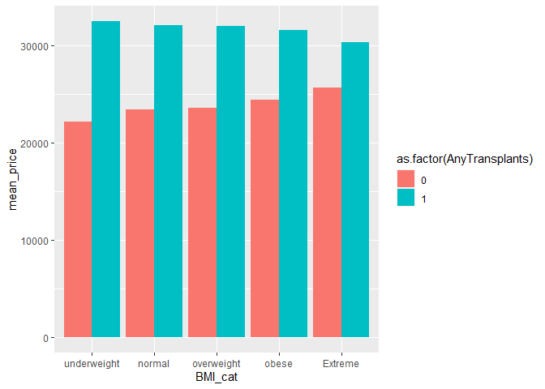
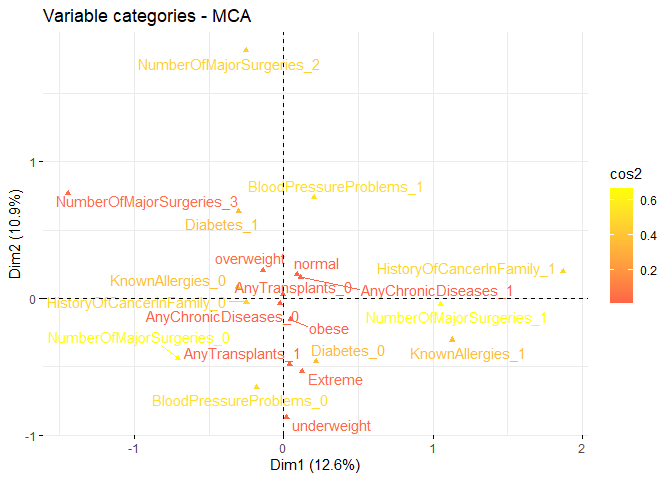
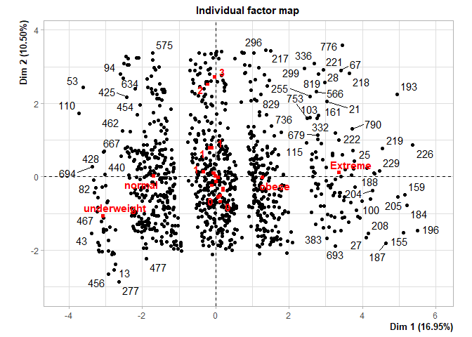
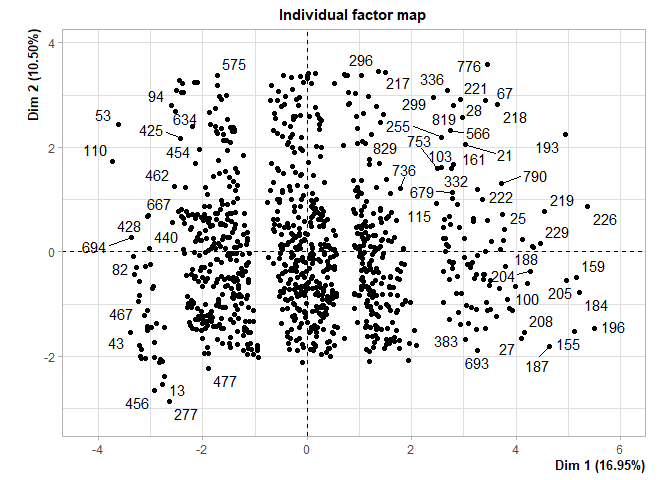
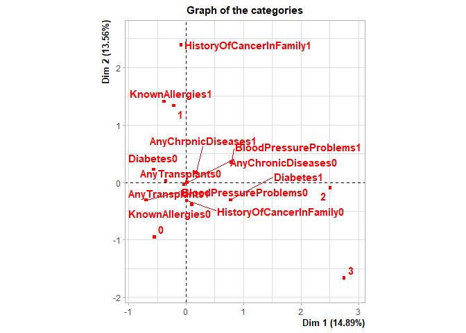
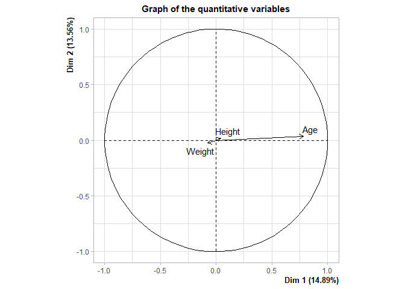

R
================

``` r
library(ggplot2)
library(dplyr)
```

    ## 
    ## Attaching package: 'dplyr'

    ## The following objects are masked from 'package:stats':
    ## 
    ##     filter, lag

    ## The following objects are masked from 'package:base':
    ## 
    ##     intersect, setdiff, setequal, union

``` r
library(GGally)
```

    ## Warning: package 'GGally' was built under R version 4.3.2

    ## Registered S3 method overwritten by 'GGally':
    ##   method from   
    ##   +.gg   ggplot2

``` r
library(readr)
library(ggjoy)
```

    ## Warning: package 'ggjoy' was built under R version 4.3.2

    ## Loading required package: ggridges

    ## Warning: package 'ggridges' was built under R version 4.3.2

    ## The ggjoy package has been deprecated. Please switch over to the
    ## ggridges package, which provides the same functionality. Porting
    ## guidelines can be found here:
    ## https://github.com/clauswilke/ggjoy/blob/master/README.md

``` r
Medicalpremium <- read_csv("C:/Users/malis/3rdYear/New folder (3)/New folder/Medicalpremium.csv")
```

    ## Rows: 986 Columns: 11

    ## ── Column specification ────────────────────────────────────────────────────────
    ## Delimiter: ","
    ## dbl (11): Age, Diabetes, BloodPressureProblems, AnyTransplants, AnyChronicDi...
    ## 
    ## ℹ Use `spec()` to retrieve the full column specification for this data.
    ## ℹ Specify the column types or set `show_col_types = FALSE` to quiet this message.

``` r
df = Medicalpremium

lapply(df, class)
```

    ## $Age
    ## [1] "numeric"
    ## 
    ## $Diabetes
    ## [1] "numeric"
    ## 
    ## $BloodPressureProblems
    ## [1] "numeric"
    ## 
    ## $AnyTransplants
    ## [1] "numeric"
    ## 
    ## $AnyChronicDiseases
    ## [1] "numeric"
    ## 
    ## $Height
    ## [1] "numeric"
    ## 
    ## $Weight
    ## [1] "numeric"
    ## 
    ## $KnownAllergies
    ## [1] "numeric"
    ## 
    ## $HistoryOfCancerInFamily
    ## [1] "numeric"
    ## 
    ## $NumberOfMajorSurgeries
    ## [1] "numeric"
    ## 
    ## $PremiumPrice
    ## [1] "numeric"

``` r
unique(df$NumberOfMajorSurgeries)
```

    ## [1] 0 1 2 3

``` r
ggplot(df, mapping=aes(x=Age, 
                       y=as.factor(NumberOfMajorSurgeries),
                       fill=as.factor(NumberOfMajorSurgeries))) +
  geom_boxplot() +
  geom_jitter(alpha=0.2, size=0.5)
```

<!-- -->

``` r
ggplot(df, aes(x=df$Age, y=as.factor(df$Diabetes), fill=as.factor(df$Diabetes))) +
  geom_boxplot()
```

<!-- -->

``` r
ggplot() +
  geom_point(df, mapping=aes(x=df$Weight, y=df$Height, color=as.factor(df$BloodPressureProblems)))
```

<!-- -->

``` r
ggcorr(df[c("Age", "Weight", "Height", "PremiumPrice")])
```

<!-- -->

``` r
ggplot() +
  geom_joy(df, mapping=aes(x=Age, y=as.factor(df$NumberOfMajorSurgeries), 
                           fill=as.factor(df$NumberOfMajorSurgeries)))
```

    ## Picking joint bandwidth of 2.39

<!-- -->

``` r
ggplot() +
  geom_joy(df, mapping=aes(x=Age, y=as.factor(NumberOfMajorSurgeries), 
                           fill=as.factor(NumberOfMajorSurgeries))) + 
  facet_grid(~Diabetes, 
             labeller=labeller(.rows=label_both, .cols=label_both))
```

    ## Picking joint bandwidth of 3.22

    ## Picking joint bandwidth of 2.88

<!-- -->

``` r
ggplot() +
  geom_joy(df, mapping=aes(x=Age, y=as.factor(NumberOfMajorSurgeries), 
                           fill=as.factor(NumberOfMajorSurgeries))) + 
  facet_grid(~BloodPressureProblems, 
             labeller=labeller(.rows=label_both, .cols=label_both))
```

    ## Picking joint bandwidth of 2.58

    ## Picking joint bandwidth of 2.69

<!-- -->

``` r
df= df %>%
  mutate(BMI = df$Weight/((df$Height/100)^2)) %>%
  mutate(BMI_cat = cut(BMI, breaks=c(-Inf, 18.5, 24.5, 29.9, 34.9, Inf), 
                       labels=c("underweight", "normal", "overweight", "obese", "Extreme")))
```

``` r
df
```

    ## # A tibble: 986 × 13
    ##      Age Diabetes BloodPressureProblems AnyTransplants AnyChronicDiseases Height
    ##    <dbl>    <dbl>                 <dbl>          <dbl>              <dbl>  <dbl>
    ##  1    45        0                     0              0                  0    155
    ##  2    60        1                     0              0                  0    180
    ##  3    36        1                     1              0                  0    158
    ##  4    52        1                     1              0                  1    183
    ##  5    38        0                     0              0                  1    166
    ##  6    30        0                     0              0                  0    160
    ##  7    33        0                     0              0                  0    150
    ##  8    23        0                     0              0                  0    181
    ##  9    48        1                     0              0                  0    169
    ## 10    38        0                     0              0                  0    182
    ## # ℹ 976 more rows
    ## # ℹ 7 more variables: Weight <dbl>, KnownAllergies <dbl>,
    ## #   HistoryOfCancerInFamily <dbl>, NumberOfMajorSurgeries <dbl>,
    ## #   PremiumPrice <dbl>, BMI <dbl>, BMI_cat <fct>

``` r
ggplot() +
  geom_joy(df, mapping=aes(x=Age, y=BMI_cat, 
                           fill=BMI_cat)) +
  facet_grid(~Diabetes, 
             labeller=labeller(.rows=label_both, .cols=label_both))
```

    ## Picking joint bandwidth of 4.79

    ## Picking joint bandwidth of 5.71

<!-- -->

``` r
BMI.count = df %>%
  group_by(BMI_cat) %>%
  tally() %>%
  arrange(desc(n))
```

``` r
ggplot() +
  geom_bar(df, mapping=aes(x=BMI_cat, fill=BMI_cat))
```

<!-- -->

``` r
ggplot() +
  geom_bar(df, mapping=aes(x=BMI_cat, fill=as.factor(AnyChronicDiseases)), position="fill")
```

<!-- -->

``` r
temp = df %>% 
  group_by(BMI_cat) %>%
  summarise(mean_price=mean(PremiumPrice)) %>%
  arrange(desc(mean_price))
```

``` r
ggplot() +
  geom_bar(temp, mapping=aes(x=BMI_cat, y=mean_price), stat="identity")
```

<!-- -->

``` r
fun = function(cat) {
  temp = df %>% 
    group_by(df[c(cat)]) %>%
    summarise(mean_price=mean(PremiumPrice)) %>%
    arrange(desc(mean_price))
  temp[[cat]] = as.factor(temp[[cat]])
  ggplot() +
    geom_bar(temp, mapping=aes_string(x=cat, y="mean_price", fill=cat), stat="identity")
  }
```

``` r
fun("BloodPressureProblems")
```

    ## Warning: `aes_string()` was deprecated in ggplot2 3.0.0.
    ## ℹ Please use tidy evaluation idioms with `aes()`.
    ## ℹ See also `vignette("ggplot2-in-packages")` for more information.
    ## This warning is displayed once every 8 hours.
    ## Call `lifecycle::last_lifecycle_warnings()` to see where this warning was
    ## generated.

<!-- -->

``` r
fun("AnyChronicDiseases")
```

<!-- -->

``` r
fun("NumberOfMajorSurgeries")
```

<!-- -->

``` r
temp = df %>%
  group_by(BMI_cat, AnyTransplants) %>%
  summarise(mean_price=mean(PremiumPrice))
```

    ## `summarise()` has grouped output by 'BMI_cat'. You can override using the
    ## `.groups` argument.

``` r
temp
```

    ## # A tibble: 10 × 3
    ## # Groups:   BMI_cat [5]
    ##    BMI_cat     AnyTransplants mean_price
    ##    <fct>                <dbl>      <dbl>
    ##  1 underweight              0     22135.
    ##  2 underweight              1     32500 
    ##  3 normal                   0     23432.
    ##  4 normal                   1     32071.
    ##  5 overweight               0     23612.
    ##  6 overweight               1     32000 
    ##  7 obese                    0     24459.
    ##  8 obese                    1     31583.
    ##  9 Extreme                  0     25711.
    ## 10 Extreme                  1     30333.

``` r
ggplot() +
  geom_bar(temp, mapping=aes(x=BMI_cat, y=mean_price, fill=as.factor(AnyTransplants)),
                             position="dodge", stat="identity")
```

<!-- -->

``` r
ggplot() +
  geom_jitter(df, mapping=aes(x=Age, y=PremiumPrice, color=as.factor(NumberOfMajorSurgeries)))
```

<!-- -->

## PCA

``` r
library(FactoMineR)
```

    ## Warning: package 'FactoMineR' was built under R version 4.3.2

``` r
library(factoextra)
```

    ## Warning: package 'factoextra' was built under R version 4.3.2

    ## Welcome! Want to learn more? See two factoextra-related books at https://goo.gl/ve3WBa

``` r
df.num = df[, c("Age", "Weight", "Height")]
```

``` r
res.pca = PCA(df.num, scale.unit=T, ncp=2, graph=T)
```

<!-- --><!-- -->

``` r
res.pca$eig
```

    ##        eigenvalue percentage of variance cumulative percentage of variance
    ## comp 1  1.0708248               35.69416                          35.69416
    ## comp 2  1.0161199               33.87066                          69.56482
    ## comp 3  0.9130553               30.43518                         100.00000

``` r
get_eigenvalue(res.pca)
```

    ##       eigenvalue variance.percent cumulative.variance.percent
    ## Dim.1  1.0708248         35.69416                    35.69416
    ## Dim.2  1.0161199         33.87066                    69.56482
    ## Dim.3  0.9130553         30.43518                   100.00000

``` r
fviz_eig(res.pca, addlabels=T, ylim=c(0, 50))
```

<!-- -->

``` r
var = get_pca_var(res.pca)
var$coord
```

    ##            Dim.1      Dim.2
    ## Age    0.2575018  0.8722822
    ## Weight 0.6519506 -0.4896825
    ## Height 0.7612346  0.1243173

``` r
var$cor
```

    ##            Dim.1      Dim.2
    ## Age    0.2575018  0.8722822
    ## Weight 0.6519506 -0.4896825
    ## Height 0.7612346  0.1243173

``` r
var$cos2
```

    ##             Dim.1      Dim.2
    ## Age    0.06630715 0.76087620
    ## Weight 0.42503957 0.23978896
    ## Height 0.57947808 0.01545479

``` r
var$contrib
```

    ##            Dim.1     Dim.2
    ## Age     6.192157 74.880550
    ## Weight 39.692727 23.598489
    ## Height 54.115116  1.520961

#### Correlation circle

``` r
fviz_pca_var(res.pca, col.var="red")
```

<!-- -->
\#### Quality of representaion

``` r
library(corrplot)
```

    ## corrplot 0.92 loaded

``` r
corrplot(var$cos2, is.corr=F)
```

<!-- -->

``` r
fviz_cos2(res.pca, choice="var", axes=1:2)
```

<!-- -->

``` r
fviz_pca_var(res.pca, col.var = "cos2",
             gradient.cols = c("#00AFBB", "#E7B800", "#FC4E07"), 
             repel = TRUE # Avoid text overlapping
             )
```

<!-- -->

``` r
fviz_pca_var(res.pca, col.var="contrib", gradient.cols=c("#00AFBB", "#E7B800", "#FC4E07"))
```

<!-- --> \###
kmeans

``` r
set.seed(123)
res.km = kmeans(var$coord, centers=2, nstart=25)
grp = as.factor(res.km$cluster)
grp
```

    ##    Age Weight Height 
    ##      2      1      1 
    ## Levels: 1 2

``` r
fviz_pca_var(res.pca, col.var=grp, palette=c("red", "tomato",
                                             "orange"),
             legend.title='cluster')
```

<!-- -->

``` r
res.desc = dimdesc(res.pca, axes=c(1, 2), proba=0.05)
res.desc
```

    ## $Dim.1
    ## 
    ## Link between the variable and the continuous variables (R-square)
    ## =================================================================================
    ##        correlation       p.value
    ## Height   0.7612346 2.676120e-187
    ## Weight   0.6519506 2.149809e-120
    ## Age      0.2575018  2.132753e-16
    ## 
    ## $Dim.2
    ## 
    ## Link between the variable and the continuous variables (R-square)
    ## =================================================================================
    ##        correlation       p.value
    ## Age      0.8722822 5.584104e-308
    ## Height   0.1243173  9.082404e-05
    ## Weight  -0.4896825  1.360335e-60

### Individuals

``` r
ind = get_pca_ind(res.pca)
```

``` r
fviz_pca_ind(res.pca, col.ind=as.factor(df$NumberOfMajorSurgeries),
             palette= c("red", "green", "blue", "purple"),
             geom.ind="point", 
             addEllipses=T)
```

<!-- -->

``` r
fviz_pca_biplot(res.pca, geom="point")
```

<!-- -->

## Correspondence analysis

``` r
dt = table(df$BMI_cat, as.factor(df$NumberOfMajorSurgeries))
dt
```

    ##              
    ##                 0   1   2   3
    ##   underweight  20  16   2   1
    ##   normal      129 116  37   3
    ##   overweight  171 128  47   5
    ##   obese       106  75  21   6
    ##   Extreme      53  37  12   1

``` r
library(gplots)
```

    ## Warning: package 'gplots' was built under R version 4.3.2

    ## 
    ## Attaching package: 'gplots'

    ## The following object is masked from 'package:stats':
    ## 
    ##     lowess

``` r
balloonplot(dt, show.margins=F, label=F, main="surgeryn VS BMI_cat", ylab="", xlab="")
```

<!-- -->

``` r
chisq = chisq.test(dt)
```

    ## Warning in chisq.test(dt): Chi-squared approximation may be incorrect

``` r
chisq$statistic
```

    ## X-squared 
    ##  8.421615

``` r
corrplot(chisq$residuals, is.corr=F)
```

<!-- -->

``` r
res.ca = CA(dt)
```

<!-- -->

``` r
get_eigenvalue(res.ca)
```

    ##         eigenvalue variance.percent cumulative.variance.percent
    ## Dim.1 0.0060770696        71.150141                    71.15014
    ## Dim.2 0.0017343722        20.305976                    91.45612
    ## Dim.3 0.0007297494         8.543883                   100.00000

``` r
fviz_ca_row(res.ca, repel=T)
```

<!-- -->

``` r
res.ca$row$cos2
```

    ##                 Dim 1      Dim 2       Dim 3
    ## underweight 0.6410877 0.30597366 0.052938661
    ## normal      0.7010776 0.27988511 0.019037259
    ## overweight  0.4270454 0.57022527 0.002729333
    ## obese       0.9537133 0.01159666 0.034690055
    ## Extreme     0.0130577 0.13584498 0.851097318

``` r
fviz_ca_row(res.ca, col.row="cos2", 
            gradient.cols=c("red", "green"))
```

<!-- -->

``` r
res.ca$col$cos2
```

    ##       Dim 1       Dim 2      Dim 3
    ## 0 0.6136396 0.225773672 0.16058673
    ## 1 0.1561653 0.828659921 0.01517479
    ## 2 0.7873407 0.159747121 0.05291220
    ## 3 0.8803337 0.004754302 0.11491204

``` r
fviz_ca_biplot(res.ca, map="rowgreen", arrow=c(T, F), repel=T)
```

<!-- --> \##
Multiple correspondence analysis

``` r
df.cat = df[, -c(which(colnames(df) %in% c("Age", "Weight", "Height", "BMI", "PremiumPrice")))]
```

``` r
df.cat[, -c(which(colnames(df.cat) == "BMI_cat"))] = lapply(df.cat[, -c(which(colnames(df.cat) == "BMI_cat"))], factor)
```

``` r
sapply(df.cat, class)
```

    ##                Diabetes   BloodPressureProblems          AnyTransplants 
    ##                "factor"                "factor"                "factor" 
    ##      AnyChronicDiseases          KnownAllergies HistoryOfCancerInFamily 
    ##                "factor"                "factor"                "factor" 
    ##  NumberOfMajorSurgeries                 BMI_cat 
    ##                "factor"                "factor"

``` r
summary(df.cat)
```

    ##  Diabetes BloodPressureProblems AnyTransplants AnyChronicDiseases
    ##  0:572    0:524                 0:931          0:808             
    ##  1:414    1:462                 1: 55          1:178             
    ##                                                                  
    ##                                                                  
    ##                                                                  
    ##  KnownAllergies HistoryOfCancerInFamily NumberOfMajorSurgeries
    ##  0:774          0:870                   0:479                 
    ##  1:212          1:116                   1:372                 
    ##                                         2:119                 
    ##                                         3: 16                 
    ##                                                               
    ##         BMI_cat   
    ##  underweight: 39  
    ##  normal     :285  
    ##  overweight :351  
    ##  obese      :208  
    ##  Extreme    :103

``` r
res.mca = MCA(df.cat)
```

    ## Warning: ggrepel: 2 unlabeled data points (too many overlaps). Consider
    ## increasing max.overlaps

<!-- --><!-- --><!-- -->

``` r
fviz_screeplot(res.mca, addlabels=T, ylim=c(0, 45))
```

<!-- -->

``` r
fviz_mca_biplot(res.mca, repel=T, geom="point")
```

<!-- -->

``` r
fviz_mca_var(res.mca, choice="mca.cor", repel=T)
```

<!-- -->

``` r
res.mca$var$contrib
```

    ##                                  Dim 1       Dim 2       Dim 3        Dim 4
    ## Diabetes_0                1.676125e+00  8.65701709  5.73750547 9.969085e-03
    ## Diabetes_1                2.315805e+00 11.96090284  7.92718147 1.377371e-02
    ## BloodPressureProblems_0   1.055358e+00 16.01445823  0.54863261 4.498353e-03
    ## BloodPressureProblems_1   1.196986e+00 18.16358466  0.62225863 5.102028e-03
    ## AnyTransplants_0          3.359932e-04  0.05400141  0.09775052 1.594288e+00
    ## AnyTransplants_1          5.687448e-03  0.91409667  1.65464967 2.698694e+01
    ## AnyChronicDiseases_0      3.144345e-02  0.06732405  6.32279322 1.570359e+00
    ## AnyChronicDiseases_1      1.427321e-01  0.30560579 28.70121865 7.128371e+00
    ## KnownAllergies_0          4.605175e+00  0.38457006  0.40690110 4.043804e-02
    ## KnownAllergies_1          1.681323e+01  1.40404353  1.48557288 1.476370e-01
    ## HistoryOfCancerInFamily_0 3.368720e+00  0.04402389  0.10562539 9.165656e-05
    ## HistoryOfCancerInFamily_1 2.526540e+01  0.33017915  0.79219046 6.874242e-04
    ## NumberOfMajorSurgeries_0  1.479740e+01  6.69822370  0.66366684 3.983776e-01
    ## NumberOfMajorSurgeries_1  2.550513e+01  0.05194963  0.39442982 4.989058e-01
    ## NumberOfMajorSurgeries_2  4.677750e-01 28.00976980  1.99461120 1.514195e+00
    ## NumberOfMajorSurgeries_3  2.069984e+00  0.68296857 27.88624638 1.158393e+01
    ## underweight               9.656443e-04  2.10989697  0.16520984 3.328319e+00
    ## normal                    1.392544e-01  0.63961761  4.30602814 2.669131e-03
    ## overweight                4.155211e-01  1.03150791  0.77431370 4.531366e-01
    ## obese                     2.715055e-02  0.36482142  9.12997114 7.294883e+00
    ## Extreme                   9.982050e-02  2.11143702  0.28324289 3.742342e+01
    ##                                  Dim 5
    ## Diabetes_0                3.008222e-06
    ## Diabetes_1                4.156288e-06
    ## BloodPressureProblems_0   1.228401e-01
    ## BloodPressureProblems_1   1.393251e-01
    ## AnyTransplants_0          1.325836e+00
    ## AnyTransplants_1          2.244279e+01
    ## AnyChronicDiseases_0      9.892078e-02
    ## AnyChronicDiseases_1      4.490336e-01
    ## KnownAllergies_0          8.079462e-01
    ## KnownAllergies_1          2.949766e+00
    ## HistoryOfCancerInFamily_0 1.727261e-01
    ## HistoryOfCancerInFamily_1 1.295446e+00
    ## NumberOfMajorSurgeries_0  3.612404e-05
    ## NumberOfMajorSurgeries_1  2.108723e-02
    ## NumberOfMajorSurgeries_2  4.319337e-01
    ## NumberOfMajorSurgeries_3  1.265701e+00
    ## underweight               2.132101e+01
    ## normal                    2.396556e+01
    ## overweight                1.681817e+01
    ## obese                     4.826881e-01
    ## Extreme                   5.889167e+00

``` r
fviz_mca_var(res.mca, col.var="cos2", gradient.cols=c("tomato", "yellow"), repel=T)
```

<!-- -->

``` r
fviz_mca_ind(res.mca, palette=c("yellow", "tomato"), repel=T, habillage="Diabetes", addEllipses=T, geom="point")
```

<!-- --> \##
Factor Analysis

``` r
df[, -c(which(colnames(df) %in% c("Age", "Weight", "Height", "BMI", "PremiumPrice")))] = lapply(df.cat, factor)
```

``` r
sapply(df, class)
```

    ##                     Age                Diabetes   BloodPressureProblems 
    ##               "numeric"                "factor"                "factor" 
    ##          AnyTransplants      AnyChronicDiseases                  Height 
    ##                "factor"                "factor"               "numeric" 
    ##                  Weight          KnownAllergies HistoryOfCancerInFamily 
    ##               "numeric"                "factor"                "factor" 
    ##  NumberOfMajorSurgeries            PremiumPrice                     BMI 
    ##                "factor"               "numeric"               "numeric" 
    ##                 BMI_cat 
    ##                "factor"

``` r
X = df[, -c(which(colnames(df) == "PremiumPrice"))]
```

``` r
dim(X)
```

    ## [1] 986  12

``` r
res.famd.a = FAMD(X)
```

    ## Warning: ggrepel: 926 unlabeled data points (too many overlaps). Consider
    ## increasing max.overlaps

    ## Warning: ggrepel: 10 unlabeled data points (too many overlaps). Consider
    ## increasing max.overlaps

<!-- -->

    ## Warning: ggrepel: 926 unlabeled data points (too many overlaps). Consider
    ## increasing max.overlaps

<!-- --><!-- -->

    ## Warning: ggrepel: 4 unlabeled data points (too many overlaps). Consider
    ## increasing max.overlaps

<!-- --><!-- -->

``` r
res.famd.a$eig
```

    ##        eigenvalue percentage of variance cumulative percentage of variance
    ## comp 1   2.880723              16.945428                          16.94543
    ## comp 2   1.785700              10.504120                          27.44955
    ## comp 3   1.630728               9.592515                          37.04206
    ## comp 4   1.168548               6.873809                          43.91587
    ## comp 5   1.162188               6.836399                          50.75227

``` r
fviz_screeplot(res.famd.a)
```

<!-- -->

``` r
fviz_mfa_ind(res.famd.a, habillage="BMI_cat", palette=c("red", "blue", "green", "yellow", "purple"), addEllipses=T, repel=T, geom="point")
```

<!-- -->

``` r
res.km.a = kmeans(res.famd.a$ind$coord, centers=4, nstart=25)
fviz_mfa_ind(res.famd.a, habillage=as.factor(res.km.a$cluster), palette=c("red", "blue", "green", "yellow", "purple", "black"), addEllipses=F, repel=T, geom="point")
```

<!-- -->

``` r
X
```

    ## # A tibble: 986 × 12
    ##      Age Diabetes BloodPressureProblems AnyTransplants AnyChronicDiseases Height
    ##    <dbl> <fct>    <fct>                 <fct>          <fct>               <dbl>
    ##  1    45 0        0                     0              0                     155
    ##  2    60 1        0                     0              0                     180
    ##  3    36 1        1                     0              0                     158
    ##  4    52 1        1                     0              1                     183
    ##  5    38 0        0                     0              1                     166
    ##  6    30 0        0                     0              0                     160
    ##  7    33 0        0                     0              0                     150
    ##  8    23 0        0                     0              0                     181
    ##  9    48 1        0                     0              0                     169
    ## 10    38 0        0                     0              0                     182
    ## # ℹ 976 more rows
    ## # ℹ 6 more variables: Weight <dbl>, KnownAllergies <fct>,
    ## #   HistoryOfCancerInFamily <fct>, NumberOfMajorSurgeries <fct>, BMI <dbl>,
    ## #   BMI_cat <fct>

``` r
X.copy = X
```

``` r
cat.cols = colnames(X)[lapply(X, class) == "factor"]
temp = lapply(X[, cat.cols], nlevels)
cat.cols.bi = colnames(X[, cat.cols])[temp == 2]
cat.cols.bi
```

    ## [1] "Diabetes"                "BloodPressureProblems"  
    ## [3] "AnyTransplants"          "AnyChronicDiseases"     
    ## [5] "KnownAllergies"          "HistoryOfCancerInFamily"

``` r
for (col in cat.cols.bi) {
  X.copy[[col]] = recode_factor(X.copy[[col]], "0" = paste0(col, "0"),
                           "1" = paste0(col, "1"))
}

X.copy
```

    ## # A tibble: 986 × 12
    ##      Age Diabetes BloodPressureProblems AnyTransplants AnyChronicDiseases Height
    ##    <dbl> <fct>    <fct>                 <fct>          <fct>               <dbl>
    ##  1    45 Diabete… BloodPressureProblem… AnyTransplant… AnyChronicDisease…    155
    ##  2    60 Diabete… BloodPressureProblem… AnyTransplant… AnyChronicDisease…    180
    ##  3    36 Diabete… BloodPressureProblem… AnyTransplant… AnyChronicDisease…    158
    ##  4    52 Diabete… BloodPressureProblem… AnyTransplant… AnyChronicDisease…    183
    ##  5    38 Diabete… BloodPressureProblem… AnyTransplant… AnyChronicDisease…    166
    ##  6    30 Diabete… BloodPressureProblem… AnyTransplant… AnyChronicDisease…    160
    ##  7    33 Diabete… BloodPressureProblem… AnyTransplant… AnyChronicDisease…    150
    ##  8    23 Diabete… BloodPressureProblem… AnyTransplant… AnyChronicDisease…    181
    ##  9    48 Diabete… BloodPressureProblem… AnyTransplant… AnyChronicDisease…    169
    ## 10    38 Diabete… BloodPressureProblem… AnyTransplant… AnyChronicDisease…    182
    ## # ℹ 976 more rows
    ## # ℹ 6 more variables: Weight <dbl>, KnownAllergies <fct>,
    ## #   HistoryOfCancerInFamily <fct>, NumberOfMajorSurgeries <fct>, BMI <dbl>,
    ## #   BMI_cat <fct>

``` r
X.org = subset(X.copy, select = -c(BMI, BMI_cat))
```

``` r
res.famd = FAMD(X.org)
```

    ## Warning: ggrepel: 947 unlabeled data points (too many overlaps). Consider
    ## increasing max.overlaps

    ## Warning: ggrepel: 3 unlabeled data points (too many overlaps). Consider
    ## increasing max.overlaps

<!-- -->

    ## Warning: ggrepel: 947 unlabeled data points (too many overlaps). Consider
    ## increasing max.overlaps

<!-- --><!-- --><!-- --><!-- -->

``` r
fviz_ellipses(res.famd, c("HistoryOfCancerInFamily", "Diabetes"), geom="point")
```

    ## Warning: `gather_()` was deprecated in tidyr 1.2.0.
    ## ℹ Please use `gather()` instead.
    ## ℹ The deprecated feature was likely used in the factoextra package.
    ##   Please report the issue at <https://github.com/kassambara/factoextra/issues>.
    ## This warning is displayed once every 8 hours.
    ## Call `lifecycle::last_lifecycle_warnings()` to see where this warning was
    ## generated.

<!-- -->

``` r
fviz_famd_ind(res.famd, habillage="NumberOfMajorSurgeries", palette=c("red", "blue", "green", "yellow"), addEllipses=T, repel=T, geom="point")
```

<!-- -->

``` r
fviz_famd_ind(res.famd, habillage=X$BMI_cat, palette=c("red", "blue", "green", "yellow", "purple"), repel=T, geom="point")
```

<!-- -->

``` r
res.km = kmeans(res.famd$ind$coord, centers=3, nstart=25)
fviz_famd_ind(res.famd, habillage=as.factor(res.km$cluster), palette=c("tomato", "greenyellow", "skyblue"), repel=T, geom="point")
```

<!-- -->
